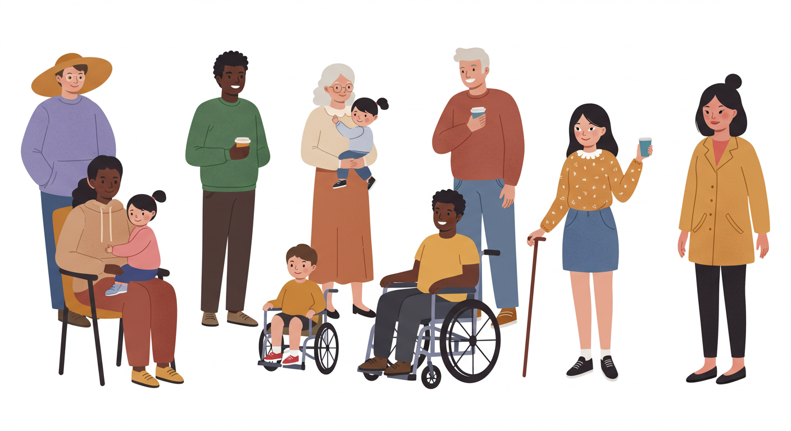

## 포용적인 디자인이란



포용적 디자인(Inclusive Design)은 디지털 환경에서 탄생한 방법론으로, 인간 다양성의 전체 스펙트럼(연령, 성별, 능력, 언어, 문화, 경제 상황 등)을 포용하고 활용하는 데 중점을 둡니다. 이는 단순히 접근성(Accessibility)을 확보하는 것을 넘어, 모든 사용자가 소속감을 느끼고 공평하게 참여할 수 있는 경험을 만드는 것을 목표로 합니다.

## 접근성, 유니버설 디자인과의 차이점

포용적 디자인은 종종 **접근성** 및 **유니버설 디자인(Universal Design)**과 혼용되지만, 중요한 차이가 있습니다. 접근성은 주로 장애를 가진 사람들이 동등하게 디지털 경험을 인지하고, 이해하고, 상호작용할 수 있도록 하는 속성 또는 결과에 초점을 맞춥니다. 이는 종종 WCAG와 같은 특정 표준 준수를 목표로 합니다. 반면, 유니버설 디자인은 가능한 한 많은 사람들이 별도의 적응 없이 사용할 수 있는 단일 제품이나 환경을 설계하는 것을 목표로 하며, 7가지 원칙(공평성, 유연성, 단순성/직관성, 인지 가능성, 오류 허용성, 적은 물리적 노력, 크기/공간)을 기반으로 합니다. 하지만 유니버설 디자인은 때때로 모든 사람을 위한 단일 솔루션을 추구함으로써 유연성이 부족하거나, 포용적 디자인만큼 다양한 관점을 포함하는 과정 자체를 강조하지 않을 수 있습니다.

- **접근성 (Accessibility):** 이는 주로 장애가 있는 사람들이 웹사이트, 도구 등 디지털 환경을 동등하게 인지하고, 이해하고, 탐색하고, 상호작용하며 기여할 수 있도록 보장하는 속성 또는 결과입니다. 종종 WCAG와 같은 법적 또는 기술적 표준 준수를 통해 측정됩니다. 접근성은 포용적 디자인의 중요한 결과물이지만, 포용적 디자인의 전체 범위를 포괄하지는 않습니다.
- **유니버설 디자인 (Universal Design):** 특별한 개조나 지원 없이 가능한 모든 사람이 사용할 수 있는 제품, 환경, 서비스를 설계하는 것을 목표로 합니다. 건축가 로널드 메이스에 의해 개념화되었으며, 공평한 사용, 사용상 유연성, 단순하고 직관적인 사용, 인지 가능한 정보, 오류에 대한 관용, 적은 물리적 노력, 접근 및 사용을 위한 크기와 공간이라는 7가지 원칙을 가지고 있습니다. 때때로 모든 사람을 위한 단일 솔루션을 지향하는 경향이 있어, 포용적 디자인이 추구하는 다양한 참여 방식 제공과는 다소 차이가 있을 수 있습니다.

이 세 가지 개념은 모두 사용자를 차별하지 않고 동등한 접근과 사용성을 추구한다는 공통된 목표를 공유합니다.10 그러나 포용적 디자인은 특히 과정 중심적이며, 배제된 그룹으로부터 배우는 것을 강조한다는 점에서 차별화됩니다.

## 포용적 디자인의 원칙

- **배제 인식 / 편견 해결 (Recognize Exclusion / Address Bias):** 디자인 과정에는 의식적이든 무의식적이든 편견이 개입될 수 있음을 인정하고, 이로 인해 발생하는 배제를 적극적으로 찾아내 해결하려는 노력이 필요합니다.18 이것이 포용적 디자인의 출발점입니다.
- **다양성으로부터 학습 / 다양한 사용자 참여 (Learn from Diversity / Involve Diverse Users):** 사람들을 디자인 과정의 중심에 두어야 합니다. 다양한 배경, 능력, 관점을 가진 사용자들의 참여는 진정한 통찰력의 핵심입니다.6 이는 공동 창작(co-creation)과 협업을 통해 이루어질 수 있습니다.22
- **선택권 제공 / 유연성 (Offer Choice / Flexibility):** 사용자의 다양한 능력, 선호도, 상황에 맞춰 상호작용하고 목표를 달성할 수 있는 여러 방법을 제공해야 합니다.18 예를 들어, 글꼴 크기나 대비 조절 옵션 18, 여러 입력 방식(키보드, 음성, 터치 등) 지원 28 등이 있습니다.
- **단순성 및 명확성 보장 / 직관적 사용 (Ensure Simplicity and Clarity / Intuitive Use):** 복잡함을 줄이고 정보 구조를 명확하게 하여 사용자가 쉽게 이해하고 다음 단계를 예측할 수 있도록 해야 합니다.18 명확하고 간결한 언어를 사용하고 전문 용어 사용을 지양해야 합니다.16
- **인지 가능한 정보 제공 (Provide Perceptible Information):** 사용자가 정보를 인지할 수 있는 다양한 방식(시각적, 청각적, 촉각적 등)으로 정보를 제공해야 합니다.10 이미지에 대한 대체 텍스트(alt text) 18, 오디오/비디오 콘텐츠에 대한 자막 및 스크립트 18, 충분한 색상 대비 18 등이 이에 해당합니다.
- **오류 허용성 통합 / 관용 (Incorporate Error Tolerance / Forgiveness):** 사용자가 실수를 하더라도 그 결과가 치명적이지 않도록 설계하고, 쉽게 오류를 감지하고 복구할 수 있는 방법을 제공해야 합니다.4 예를 들어, 중요한 작업을 수행하기 전에 확인 메시지를 표시하는 것이 좋습니다.26
- **하나를 위한 해결책, 다수에게 확장 (Solve for One, Extend to Many):** 특정 그룹(예: 영구적인 장애를 가진 사람)의 요구를 해결하기 위해 설계된 솔루션이 종종 훨씬 더 광범위한 사용자 그룹에게 혜택을 준다는 원칙입니다.6 도로 연석 낮춤(curb cut), 고대비 모드, 자막 등이 대표적인 예입니다.8

## 포용적 디자인의 전략적 중요성

포용적 디자인은 단순히 '하면 좋은 것'을 넘어, 현대 소프트웨어 개발에서 필수적인 전략적 요소로 자리 잡고 있습니다. 윤리적 책임감, 시장 확장 기회, 혁신 촉진, 법규 준수 및 브랜드 가치 제고 등 다각적인 측면에서 그 중요성이 부각되고 있습니다.

### 윤리적 기반과 사회적 책임

점점 더 디지털화되는 세상에서 모든 사람에게 정보와 서비스에 대한 동등한 접근권을 제공하는 것은 기본적인 윤리적 요구 사항입니다. 특정 집단을 배제하는 디자인은 차별에 해당할 수 있으며 , 이는 **기업의 사회적 책임(CSR)**과 직결됩니다. 포용적인 디자인을 통해 기업은 모든 사용자를 존중하고 포용한다는 메시지를 전달하며 사회적 신뢰를 구축할 수 있습니다. 디자인 결정이 사회 전체에 미치는 광범위한 영향을 고려하는 윤리적 디자인은 필수적입니다.

### 시장 확장: 소외된 사용자층 공략

포용적 디자인을 통해 접근성을 개선하는 것은 막대한 규모의 새로운 시장을 열 수 있는 기회입니다. **전 세계 인구의 약 15%**가 어떤 형태로든 장애를 가지고 있으며 , 이들의 총 가처분 소득은 상당한 규모에 달합니다 (예: 전 세계 약 7조 달러 추정 , 미국 내 4900억 달러 ). 접근성이 낮은 제품과 서비스는 이 거대한 잠재 고객층을 놓치게 만듭니다. 실제로 접근성 문제로 인해 웹사이트를 이탈하는 사용자가 상당수이며 , 이는 직접적인 매출 손실로 이어집니다. 반면, 접근성을 우선시하는 기업들은 고객 충성도 증가와 매출 증대를 경험하는 것으로 나타났습니다. 접근성 개선이 사이트 방문 및 전환율 증가로 이어진 사례도 보고되었습니다. 이는 포용적 디자인이 단순한 비용 지출이 아니라, 새로운 수익 창출과 시장 점유율 확대를 위한 투자임을 보여줍니다.

### 포용성을 통한 혁신: '하나를 위한 해결책, 다수에게 확장'의 실현

포용적 디자인은 **혁신의 강력한 촉매제 역할**을 합니다. '하나를 위한 해결책, 다수에게 확장' 원칙에서 보듯이, 특정 사용자 그룹(특히 장애를 가진 사용자)의 고유한 요구사항을 해결하려는 노력은 종종 예상치 못한 방식으로 더 넓은 사용자층에게 유용한 기능과 개선으로 이어집니다. 특정 제약 조건(예: 특정 장애 고려) 하에서 디자인하는 것은 창의성을 자극하고 기존의 틀을 벗어난 새로운 아이디어를 창출하도록 유도합니다.

실제 사례로, 손 장애가 있는 사용자를 위해 개발된 터치패드 키보드 기술은 현재 스마트폰 인터페이스의 혁신을 이끌었습니다. 관절염 환자를 위해 디자인된 OXO Good Grips 주방 도구는 인체공학적 디자인 덕분에 모든 사용자에게 인기를 얻었습니다. 또한, 고대비 모드나 자막 기능은 원래 시각 또는 청각 장애 사용자를 위해 개발되었지만, 밝은 야외 환경 사용자나 소음이 많은 곳에서 영상을 시청하는 사용자 등 다양한 상황의 모든 사용자에게 유용하게 활용됩니다. 이처럼 접근성을 고려한 디자인은 종종 보편적인 사용성 향상으로 이어져 제품 경쟁력을 높이는 핵심 동력이 됩니다. 또한, 다양한 배경과 경험을 가진 인력으로 구성된 팀은 문제 해결에 있어 더 폭넓은 관점을 제공하여 혁신을 촉진하는 데 기여합니다.

### 법률 및 규제 환경 탐색

포용적 디자인, 특히 접근성 확보는 **법적 의무 사항**이기도 합니다. 세계 각국에서는 디지털 접근성을 보장하기 위한 법률과 표준을 시행하고 있습니다. 대표적으로 웹 콘텐츠 접근성 지침(WCAG)은 W3C에서 개발한 국제 표준으로 널리 채택되고 있으며 , 미국의 장애인법(ADA)  및 재활법 508조 , 유럽 접근성법(EAA) , 캐나다 온타리오주의 접근성법(AODA)  등이 있습니다. 한국에서도 '디지털 포용법' 제정안이 논의되는 등 , 디지털 접근성 보장에 대한 법적 요구는 강화되는 추세입니다.

이러한 법규를 준수하지 않을 경우, 기업은 소송, 벌금 부과 등 심각한 법적 위험에 직면할 수 있으며, 이는 상당한 비용 손실과 브랜드 평판 저하로 이어질 수 있습니다. 실제로 Domino's Pizza, Netflix, Target 등 여러 기업이 접근성 미준수로 인해 소송을 당한 사례가 있습니다. 따라서 법규 준수는 단순한 의무를 넘어 비즈니스 리스크 관리의 중요한 부분이며, 포용적 디자인은 이러한 위험을 사전에 예방하는 효과적인 방법입니다.

### 브랜드 평판 및 사용자 충성도 강화

포용성을 우선시하는 기업은 사회적 책임을 다하고 모든 고객을 존중한다는 **긍정적인 이미지를 구축**할 수 있습니다. 소비자들은 포용적인 가치를 실천하는 브랜드를 선호하는 경향이 있으며 , 이는 브랜드에 대한 신뢰와 충성도 향상으로 이어집니다. 포용적인 사용자 경험은 긍정적인 입소문을 유발하고 , 결과적으로 브랜드 인지도와 가치를 높이는 데 기여합니다. 접근성 개선을 통해 더 많은 사용자가 만족스러운 경험을 하게 되면, 이는 자연스럽게 고객 유지율 증가와 신규 고객 확보로 연결될 수 있습니다.

결론적으로, 포용적 디자인은 윤리적 당위성을 넘어 시장 확장, 혁신 촉진, 법적 리스크 관리, 브랜드 가치 제고라는 실질적인 비즈니스 이점을 제공하는 핵심 전략입니다. 이는 비용이 아닌 투자이며, 장기적인 관점에서 기업의 지속 가능한 성장을 이끄는 원동력이 됩니다. 따라서 포용적 디자인을 무시하는 것은 단순히 기회를 놓치는 것을 넘어, 법적, 재정적, 평판상의 심각한 위험을 초래하는 전략적 오류라고 할 수 있습니다.

## 포용적 디자인을 위한 조사 방법론

- **심층 인터뷰 (In-depth Interviews)**
  - 설명: 다양한 배경, 능력, 경험을 가진 개인 사용자들과 일대일로 만나 깊이 있는 대화를 나누는 방법입니다. 개방형 질문을 통해 사용자의 생각, 감정, 동기, 불편함 등을 상세히 파악할 수 있습니다.
  - 포용적 접근: 의도적으로 소외되기 쉬운 그룹(예: 특정 장애인, 노인, 이민자, 디지털 소외 계층 등)을 포함하여 인터뷰 대상을 다양하게 선정하는 것이 중요합니다. 인터뷰 환경과 방식 또한 참여자의 편의와 접근성을 고려해야 합니다 (예: 수어 통역 제공, 편안한 장소 선정).
- **참여 관찰 / 민족지학적 조사 (Ethnographic Research / Contextual Inquiry)**
  - 설명: 디자이너나 연구자가 사용자의 실제 생활 환경(집, 직장, 이동 경로 등)에 직접 참여하거나 관찰하여, 특정 제품이나 서비스가 사용되는 실제 맥락과 방식을 이해하는 방법입니다. 사용자가 말로 표현하지 못하는 암묵적인 요구사항이나 문제점을 발견하는 데 유용합니다.
  - 포용적 접근: 다양한 환경과 상황에 처한 사용자들을 관찰 대상으로 포함시킵니다. 사용자의 일상에 방해가 되지 않도록 주의하며, 관찰 과정에서 발생하는 예기치 못한 장벽이나 불편함 자체도 중요한 데이터로 인식합니다.
- **페르소나 개발 (Persona Development)**
  - 설명: 사용자 조사 결과를 바탕으로 가상의 사용자 유형을 구체적으로 정의하는 방법입니다.
  - 포용적 접근: 일반적인 페르소나를 넘어, '극단 사용자(Extreme Users)' 또는 '비전형적 사용자(Atypical Users)' 페르소나를 적극적으로 개발합니다. 이는 특정 능력의 제약(시각, 청각, 운동, 인지 등), 특정 상황(일시적 제약, 환경적 제약), 다양한 문화적 배경 등을 반영하여 디자인 과정에서 고려해야 할 스펙트럼을 넓혀줍니다.
- **공감 지도 (Empathy Mapping)**
  - 설명: 특정 사용자가 무엇을 보고, 듣고, 생각하고, 느끼는지, 그리고 그 과정에서의 고충(Pains)과 얻는 것(Gains)은 무엇인지를 시각적으로 정리하여 사용자에 대한 깊은 공감을 형성하는 도구입니다.
  - 포용적 접근: 다양한 페르소나, 특히 소외될 수 있는 사용자 그룹을 대상으로 공감 지도를 작성하여 그들의 독특한 관점과 경험을 팀 전체가 이해하도록 돕습니다.
- **다이어리 스터디 (Diary Studies)**
  - 설명: 참여자들이 일정 기간 동안 특정 활동이나 경험에 대해 기록(글, 사진, 영상 등)하도록 요청하는 방법입니다. 시간의 흐름에 따른 사용 패턴 변화나 특정 맥락에서의 경험을 파악하는 데 유용합니다.
  - 포용적 접근: 참여자가 편리하게 기록할 수 있도록 다양한 기록 방식(음성 녹음, 쉬운 인터페이스의 앱 등)을 제공하고, 참여자의 능력과 상황에 맞는 가이드라인을 제시합니다.
- **참여 디자인 / 공동 디자인 워크숍 (Participatory Design / Co-design Workshops)**
  - 설명: 디자이너, 개발자, 그리고 다양한 최종 사용자들이 함께 모여 아이디어를 발상하고, 프로토타입을 만들고, 평가하는 워크숍 형태의 활동입니다. 사용자는 단순한 정보 제공자를 넘어 디자인 파트너로서 참여합니다.
  - 포용적 접근: 워크숍 기획 단계부터 다양한 능력과 배경을 가진 사용자들이 동등하게 참여할 수 있도록 환경(물리적 접근성, 언어 지원 등)과 진행 방식(다양한 의사소통 방식 활용)을 세심하게 설계해야 합니다.
- **포커스 그룹 인터뷰 (Focus Group Interviews - FGI)**
  - 설명: 특정 주제에 대해 다양한 배경을 가진 소그룹의 사람들을 모아 의견을 나누는 방법입니다. 그룹 내 상호작용을 통해 개별 인터뷰에서 얻기 힘든 다양한 관점과 아이디어를 얻을 수 있습니다.
  - 포용적 접근: 그룹 구성 시 의도적으로 다양한 능력, 연령, 문화적 배경 등을 가진 참여자들을 포함시키고, 모든 참여자가 편안하게 자신의 의견을 표현할 수 있는 분위기를 조성하는 것이 중요합니다.
- **사용자 자문단 운영 (User Advisory Panels)**
  - 설명: 특정 프로젝트나 제품 개발 과정 전반에 걸쳐 지속적으로 피드백과 자문을 제공할 수 있는 다양한 사용자 그룹을 구성하여 운영합니다.
  - 포용적 접근: 자문단 구성 시 다양성을 확보하고, 정기적인 소통 채널을 마련하며, 참여자들의 기여에 대해 적절히 보상하고 존중하는 문화를 구축합니다.

## 포용적인 인터페이스 디자인

> [!NOTE]
>
> 포용적인 인터페이스 디자인은 사용자 인터페이스와 경험의 근본적인 구조를 유연하고, 단순하며, 인지 가능하고, 관용적으로 만드는 과정으로 사용자에게 선택권을 부여하고 정보를 다중 채널로 제공하는 형태로 나타난다

- **유연성 및 맞춤화 제공**
  - 텍스트 크기 조절: 사용자가 편안하게 읽을 수 있도록 시스템 설정(예: iOS의 Dynamic Type)을 지원하거나 앱 내에서 글꼴 크기를 조절할 수 있는 옵션을 제공합니다.
  - 색상 및 대비 조절: 색각 이상이나 저시력 사용자를 위해 색상 테마나 고대비 모드를 제공합니다.
  - 다양한 상호작용 방식: 키보드, 마우스, 터치, 음성 명령 등 여러 입력 방식을 지원하고, 사용자가 선호하는 방식을 선택할 수 있도록 합니다.
- **단순성 및 직관성 확보**
  - 콘텐츠 우선순위 설정: 각 화면이나 기능의 핵심 목적을 명확히 하고, 가장 중요한 정보나 작업을 우선적으로 제시합니다.19 부가 정보는 필요시 점진적으로 노출(progressive disclosure)합니다.
  - 명확하고 간결한 언어 사용: 전문 용어나 모호한 표현을 피하고, 모든 사용자가 쉽게 이해할 수 있는 직관적인 언어를 사용합니다.
  - 일관된 디자인 패턴: 예측 가능한 인터페이스를 위해 일관된 내비게이션 구조, 레이아웃, 용어, 아이콘 등을 사용합니다.
- **인지 가능한 정보 전달**
  - 충분한 색상 대비: 텍스트와 배경, 중요한 그래픽 요소와 인접 요소 간에 충분한 명도 대비(WCAG AA 기준: 일반 텍스트 4.5:1, 큰 텍스트/UI 요소 3:1)를 확보합니다.
  - 색상 외 정보 전달 수단 활용: 색상만으로 정보를 구분하거나 상태를 나타내지 않고, 아이콘, 텍스트 레이블, 패턴, 형태 등 시각적 단서를 함께 사용합니다.
  - 텍스트 대안 제공: 모든 이미지, 비디오, 오디오 콘텐츠에는 해당 내용을 이해할 수 있는 대체 텍스트, 자막, 스크립트 등을 제공하여 시각 또는 청각 장애가 있는 사용자도 정보에 접근할 수 있도록 합니다.
  - 가독성 높은 텍스트: 읽기 쉬운 글꼴, 적절한 글자 크기 및 줄 간격, 충분한 여백 등을 통해 텍스트 가독성을 높입니다.
- **오류 허용성 설계**
  - 오류 예방: 사용자가 실수를 저지를 가능성을 최소화하도록 인터페이스를 설계합니다(예: 명확한 지침 제공, 비활성화 상태 표시).
  - 명확한 오류 피드백 및 복구 지원: 오류 발생 시, 사용자가 문제를 이해하고 쉽게 수정하거나 이전 상태로 돌아갈 수 있도록 명확하고 구체적인 오류 메시지와 해결 방법을 안내합니다. 파괴적인 작업 전에는 확인 단계를 거칩니다.
- **적은 물리적 노력 요구**
  - 충분한 크기의 타겟: 버튼, 링크 등 상호작용 요소는 손가락이나 포인터로 쉽게 누르거나 클릭할 수 있도록 충분한 크기(예: 최소 44x44dp 또는 48x48dp 권장)로 만듭니다.
  - 적절한 간격: 컨트롤 사이에 충분한 간격을 두어 의도하지 않은 요소가 선택되는 것을 방지합니다.
  - 단순한 제스처 및 대안 제공: 자주 사용하는 상호작용에는 가능한 한 단순한 제스처를 사용하고, 복잡하거나 정밀한 제스처가 필요한 경우 탭이나 클릭 등 대체 상호작용 방법을 함께 제공합니다.

## 기술적 구현 방법

### 0. 포용적 디자인의 기본 원칙 (공통)

플랫폼별 구현 방법을 살펴보기 전에, 모든 플랫폼에 적용되는 포용적 디자인의 기본 원칙을 이해하는 것이 중요합니다. 이는 W3C의 웹 콘텐츠 접근성 지침(WCAG) 원칙과도 맥락을 같이 합니다.

- **인식 가능성 (Perceivable):** 정보와 사용자 인터페이스 구성 요소는 사용자가 인식할 수 있는 방식으로 제시되어야 합니다. (예: 대체 텍스트 제공, 자막 제공, 충분한 대비)
- **조작 가능성 (Operable):** 사용자 인터페이스 구성 요소와 탐색은 조작 가능해야 합니다. (예: 키보드 접근성 지원, 충분한 터치 영역, 음성 제어 지원)
- **이해 가능성 (Understandable):** 정보와 사용자 인터페이스의 작동 방식은 이해 가능해야 합니다. (예: 예측 가능한 작동 방식, 명확하고 간결한 언어, 일관된 디자인)
- **견고성 (Robust):** 콘텐츠는 보조 기술을 포함한 다양한 사용자 에이전트가 안정적으로 해석할 수 있을 만큼 견고해야 합니다. (예: 표준 웹 기술 사용, 의미론적 마크업)

### 1. 웹 접근성

웹에서 웹 표준 기술을 활용하여 접근성을 확보하는 것은 포용적 디자인을 시작하는 가장 좋은 방법입니다.

- **시맨틱 HTML (Semantic HTML):** HTML 요소를 그 의미에 맞게 사용하는 것은 웹 접근성의 기초입니다. 예를 들어, 내비게이션에는 `<nav>`, 버튼에는 `<button>`, 제목에는 `<h1>`부터 `<h6>`까지의 계층 구조를 사용하는 것입니다. 스크린 리더와 같은 보조 기술(Assistive Technology, AT)은 이 시맨틱 구조를 해석하여 사용자에게 콘텐츠의 의미와 구조를 전달합니다. 따라서 의미 없는 `<div>`나 `<span>` 태그를 버튼이나 제목처럼 사용하는 것을 지양하고, 해당 의미에 맞는 태그를 우선적으로 사용해야 합니다.
- **WAI-ARIA (Accessible Rich Internet Applications):** 동적인 콘텐츠나 네이티브 HTML만으로는 의미 전달이 부족한 커스텀 UI 컴포넌트의 접근성을 향상시키기 위해 사용되는 W3C 기술 명세입니다. ARIA는 역할(role), 상태(state), 속성(property)을 HTML 요소에 추가하여 보조 기술에게 요소의 목적(예: role="dialog"), 현재 상태(예: aria-expanded="true"), 추가 정보(예: aria-label="닫기", aria-required="true", aria-live="polite") 등을 명시적으로 알려줍니다.
- **올바른 사용법:**

- **네이티브 HTML 우선:** 가능한 경우 의미에 맞는 HTML 태그를 먼저 사용하고, ARIA는 보조적인 역할로만 사용해야 합니다.37 예를 들어, <button> 태그에 role="button"을 중복해서 사용할 필요는 없습니다.37
- **정확한 구현 및 동적 업데이트:** ARIA 속성은 요소의 실제 상태 변화에 따라 JavaScript 등을 통해 정확하게 업데이트되어야 합니다.60
- **키보드 접근성 보장:** ARIA를 사용하여 상호작용 요소를 만드는 경우, 반드시 키보드만으로도 해당 요소에 접근하고 조작할 수 있도록 구현해야 합니다.

### 2. iOS 및 macOS 플랫폼

Apple은 접근성에 대한 강력한 지원을 제공하며, 개발자는 제공되는 프레임워크와 가이드라인을 활용하여 포용적인 앱을 구축할 수 있습니다.

- Accessibility 프레임워크 (https://developer.apple.com/documentation/accessibility)
- Human Interface Guidelines (https://developer.apple.com/design/human-interface-guidelines)

- **주요 접근성 기능 활용:**

  - **VoiceOver:** 시각 장애가 있는 사용자를 위한 화면 읽기 기능. UI 요소에 대한 레이블, 특성, 힌트를 정확하게 제공하여 VoiceOver 사용자가 앱의 내용을 이해하고 상호작용할 수 있도록 해야 합니다.
  - **Zoom:** 저시력 사용자를 위한 화면 확대 기능. 확대 시에도 레이아웃이 깨지지 않고 내용이 잘 보이도록 설계해야 합니다.
  - **Display Accommodations:** 색상 반전, 색상 필터, 투명도/움직임 줄이기 등 다양한 시각적 설정을 제공. 디자인 시 충분한 색상 대비를 고려하고, 애니메이션 의존도를 낮추는 것이 좋습니다.
  - **Dynamic Type (iOS), Text Scaling (macOS):** 사용자가 선호하는 텍스트 크기 설정을 지원해야 합니다. 레이블, 버튼 등 텍스트가 포함된 모든 UI 요소가 동적으로 크기 조절될 수 있도록 Auto Layout 및 적절한 폰트 스타일을 사용해야 합니다.
  - **Switch Control:** 물리적 스위치나 조이스틱 등으로 기기를 제어하는 기능. UI 요소에 논리적인 순서와 명확한 포커스 표시를 제공해야 합니다.
  - **AssistiveTouch:** 터치 조작이 어려운 사용자를 위한 소프트웨어 버튼 제어 기능.
  - **Siri:** 음성 명령을 통한 앱 제어. Siri Shortcut 등을 활용하여 핵심 기능에 대한 음성 접근성을 제공할 수 있습니다.

- **개발자를 위한 구현 방법 (UIKit/AppKit 및 SwiftUI):**

  - Accessibility API 사용:

    ```
    UIAccessibility
    ```

     프로토콜 (UIKit), 

    ```
    NSAccessibility
    ```

     프로토콜 (AppKit) 및 SwiftUI의 

    ```
    .accessibility
    ```

     관련 Modifier들을 사용하여 UI 요소에 접근성 정보를 제공해야 합니다.

    - `accessibilityLabel`: 요소의 목적이나 내용을 간결하게 설명합니다. (예: "뒤로 가기 버튼")
    - `accessibilityTraits`: 요소의 특성을 나타냅니다. (예: `.button`, `.image`, `.staticText`)
    - `accessibilityHint`: 요소의 동작 결과를 설명합니다. (예: "이 버튼을 누르면 이전 화면으로 이동합니다.")
    - `accessibilityValue`: 슬라이더나 스테퍼와 같이 값이 변하는 요소의 현재 값을 나타냅니다.

  - **포커스 관리:** VoiceOver나 Switch Control 사용 시 요소들이 논리적인 순서로 탐색되도록 포커스 순서를 명확하게 정의해야 합니다. 컨테이너 뷰의 `shouldGroupAccessibilityChildren` 속성을 설정하여 관련 요소들을 묶어줄 수 있습니다.

  - **Dynamic Type 지원:** `preferredFontForTextStyle`과 같은 메서드를 사용하여 사용자의 텍스트 크기 설정을 반영하고, Auto Layout을 통해 레이아웃이 유연하게 조정되도록 설계합니다.

  - **충분한 터치 영역:** 버튼이나 상호작용 가능한 요소는 최소 44x44 포인트의 터치 가능한 영역을 확보하는 것이 좋습니다.

  - **색상 대비:** 텍스트와 배경 간의 색상 대비는 WCAG 기준(일반 텍스트 4.5:1, 큰 텍스트 3:1)을 충족하도록 디자인합니다.

  - **사용자 피드백:** 작업 완료, 오류 발생 등에 대한 명확한 시각적 및 청각적 피드백을 제공합니다.

### 3. Android 플랫폼에서의 포용적 디자인 구현

Android 역시 다양한 접근성 기능을 제공하며, 개발자는 Android Accessibility API를 통해 앱의 접근성을 향상시킬 수 있습니다.

- 안드로이드 개발자를 위한 접근성 (https://www.google.com/accessibility/for-developers)
- Material Design 접근성 가이드 (https://m3.material.io/foundations/overview/principles)

- **주요 접근성 기능 활용:**

  - **TalkBack:** 시각 장애 사용자를 위한 화면 읽기 기능. UI 요소에 대한 콘텐츠 설명, 유형, 상태 등을 정확하게 제공해야 합니다.
  - **Select to Speak:** 특정 텍스트를 선택하여 음성으로 읽어주는 기능.
  - **Magnification:** 화면 전체 또는 특정 영역 확대 기능.
  - **Font size, Display size:** 사용자가 선호하는 텍스트 및 UI 요소 크기 조절 기능. Sp 단위 사용하여 텍스트 크기를 정의하고, dp 단위 사용하여 레이아웃 크기를 정의하여 시스템 설정에 반응하도록 합니다.
  - **Color Correction/Inversion:** 색각 이상 또는 저시력 사용자를 위한 색상 조정 기능.
  - **Switch Access:** 스위치 장치를 사용하여 기기를 제어하는 기능. 모든 상호작용 가능한 요소에 대한 포커스 가능성을 제공해야 합니다.
  - **Voice Access:** 음성 명령으로 앱을 제어하는 기능. 명확하고 일관된 레이블과 조작 가능한 요소를 제공해야 합니다.

- **개발자를 위한 구현 방법 (Kotlin/Java 및 Jetpack Compose):**

  - Accessibility API 사용:

    ```
    View
    ```

     클래스의 접근성 관련 속성 및 

    ```
    AccessibilityNodeInfo
    ```

    를 사용합니다. Jetpack Compose에서는 

    ```
    Modifier.semantics
    ```

    를 사용합니다.

    - `contentDescription`: 이미지나 아이콘과 같은 비-텍스트 요소의 내용을 설명합니다. (XML: `android:contentDescription`, Compose: `semantics { contentDescription = "..." }`)
    - **Focus Management:** 키보드 또는 스위치 접근 사용자가 논리적인 순서로 UI 요소를 탐색할 수 있도록 포커스 순서를 관리합니다. `focusable`, `nextFocusDown`, `nextFocusUp` 등의 속성을 사용할 수 있습니다. Jetpack Compose에서는 포커스 모디파이어를 사용합니다.

  - **Semantic Layout:** 레이아웃을 구성할 때 의미론적으로 올바른 UI 컨트롤을 사용합니다. (예: 버튼에는 `<Button>`, 편집 가능한 텍스트에는 `<EditText>`)

  - **텍스트 크기 및 밀도 지원:** 텍스트 크기는 `sp` 단위를 사용하고, 레이아웃 크기는 `dp` 단위를 사용하여 시스템 설정에 따라 유연하게 조절되도록 합니다.

  - **충분한 터치 영역:** 상호작용 가능한 요소는 최소 48x48 dp의 터치 가능한 영역을 확보하는 것이 좋습니다.

  - **색상 대비:** 텍스트와 배경 간의 색상 대비가 충분한지 확인합니다. Android Studio의 Layout Editor나 Accessibility Scanner 도구를 활용할 수 있습니다.

  - **Accessibility Scanner 활용:** 개발 중 또는 개발 완료 후 앱의 접근성 문제를 자동으로 감지하는 Google의 Accessibility Scanner 앱을 사용하여 잠재적인 문제를 파악하고 개선합니다.

### 4. Windows 플랫폼에서의 포용적 디자인 구현

Windows는 Narrator, Magnifier 등 다양한 접근성 기능을 제공하며, 개발자는 UI Automation (UIA) 프레임워크 등을 활용하여 접근성 지원 앱을 개발할 수 있습니다.

- **주요 접근성 기능 활용:**

  - **Narrator:** 시각 장애 사용자를 위한 화면 읽기 기능. UI 요소의 이름, 컨트롤 유형, 상태 등을 Narrator가 올바르게 읽도록 개발해야 합니다.
  - **Magnifier:** 화면 확대 기능. 확대 시에도 UI 요소가 명확하게 보이고 상호작용할 수 있도록 설계합니다.
  - **High Contrast themes:** 시각적 대비를 크게 높여 저시력 사용자가 화면 내용을 더 쉽게 구분할 수 있도록 합니다. High Contrast 모드에서도 앱의 내용과 기능에 접근 가능한지 테스트해야 합니다.
  - **Text Scaling:** 사용자가 선호하는 텍스트 크기를 조절하는 기능. 시스템 설정에 따라 앱의 텍스트 크기가 조정되도록 구현해야 합니다.
  - **Keyboard Navigation:** 마우스 없이 키보드(Tab, Shift+Tab, 화살표 키 등)만으로 앱 내 모든 요소에 접근하고 조작할 수 있도록 합니다. 논리적인 탭 순서와 명확한 포커스 표시를 제공해야 합니다.
  - **Sticky Keys, Filter Keys, Mouse Keys:** 키보드 및 마우스 사용이 어려운 사용자를 위한 기능.
  - **Voice Access (Windows 11):** 음성으로 Windows 및 앱을 제어하는 기능.

- **개발자를 위한 구현 방법 (WPF, UWP, WinUI 등):**

  - UI Automation (UIA) 프레임워크 사용:

     Windows 애플리케이션의 접근성을 제공하는 핵심 프레임워크입니다. 컨트롤은 Name, Control Type, IsEnabled, IsKeyboardFocusable 등 UIA 속성을 노출해야 합니다.

    - `AutomationProperties.Name`: 요소의 목적이나 내용을 설명합니다. (WPF/UWP/WinUI XAML)
    - `AutomationProperties.ControlType`: 요소의 유형을 나타냅니다. (예: `Button`, `Text`)
    - **Keyboard Accessibility:** 모든 상호작용 가능한 컨트롤이 키보드 포커스를 받을 수 있도록 하고, 논리적인 탭 순서(Tab Index)를 설정합니다. 포커스 시 시각적인 표시가 명확해야 합니다.

  - **High Contrast 지원:** High Contrast 테마가 적용될 때 앱의 UI 요소들이 올바르게 표시되는지 확인합니다. 하드코딩된 색상 대신 시스템 색상 브러시를 사용하거나, High Contrast 테마에 대한 스타일을 별도로 정의할 수 있습니다.

  - **Text Scaling 지원:** 시스템 설정의 텍스트 크기 변경이 앱에 반영되도록 합니다. 텍스트 크기를 고정 값으로 설정하지 않고, 레이아웃이 유연하게 조절되도록 설계합니다.

  - **충분한 크기 및 간격:** 상호작용 가능한 요소(버튼, 체크박스 등)는 충분한 크기와 간격을 확보하여 클릭하거나 터치하기 쉽게 합니다.

  - **오류 처리 및 피드백:** 사용자 입력 오류 시 명확한 메시지를 제공하고, 오류 필드로 포커스를 이동시키는 등 사용자에게 도움이 되는 피드백을 제공합니다.

### 5. 포용적 디자인 테스트

디자인 및 구현만큼 중요한 것은 테스트입니다. 다양한 방법을 통해 앱의 포용성을 검증해야 합니다.

- **내장된 접근성 기능 사용:** 각 플랫폼의 VoiceOver/TalkBack/Narrator, Magnifier, 키보드 탐색 등을 직접 켜고 앱을 사용해 봅니다. 개발자 본인이 직접 사용자가 되어보는 것이 중요합니다.
- **자동화 도구 활용:** 각 플랫폼별 또는 범용 접근성 검사 도구(예: Android Accessibility Scanner, 웹뷰의 경우 Axe 등)를 사용하여 기본적인 접근성 문제를 자동으로 감출합니다.
- **다양한 사용자 테스트:** 가장 효과적인 방법은 다양한 능력과 배경을 가진 실제 사용자 그룹을 대상으로 앱 사용성 테스트를 진행하는 것입니다. 이를 통해 기술적인 문제뿐만 아니라 사용 흐름이나 내용의 이해 가능성 등 실제 사용자가 겪는 어려움을 파악할 수 있습니다.
- **코어 시나리오 점검:** 앱의 핵심 기능 및 사용자 흐름이 모든 접근성 설정을 켰을 때 원활하게 작동하는지 집중적으로 테스트합니다.


------

[https://www.shopify.com/partners/blog/inclusive-design](https://www.shopify.com/partners/blog/inclusive-design)

[https://inclusive.microsoft.design](https://inclusive.microsoft.design)
