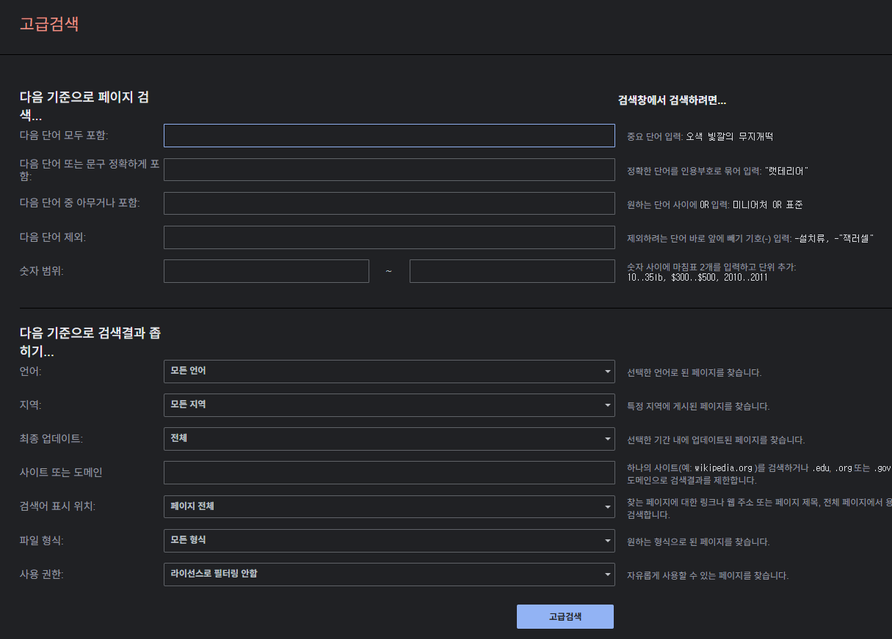
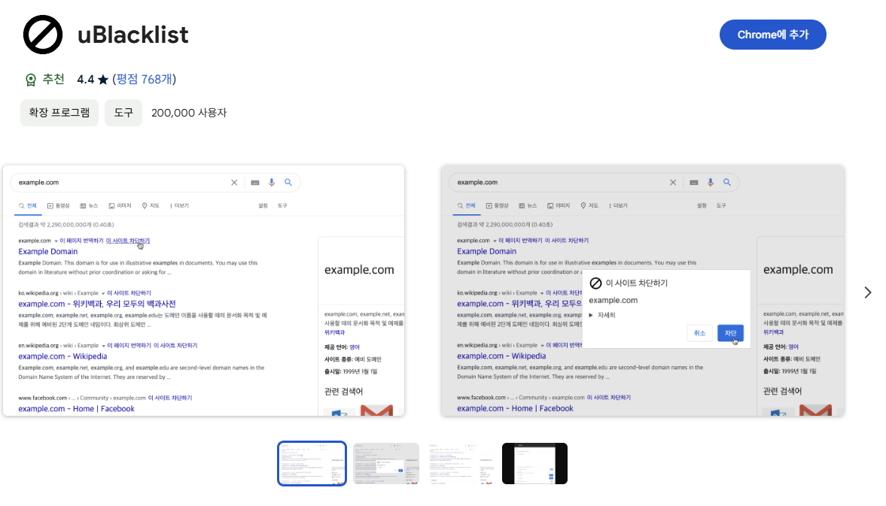
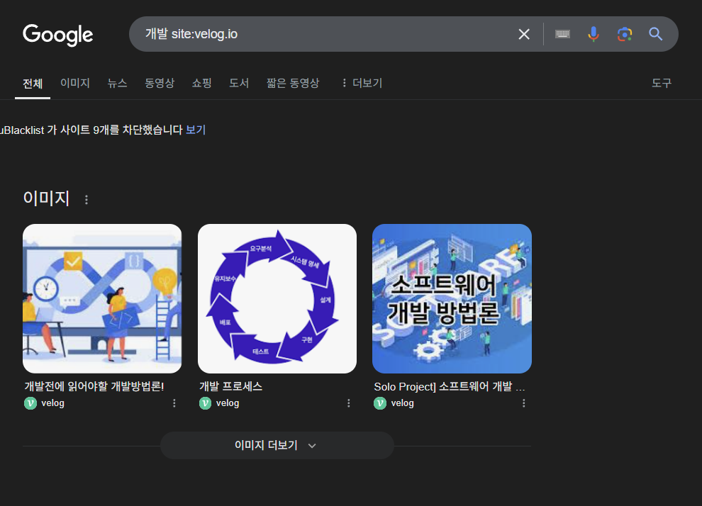
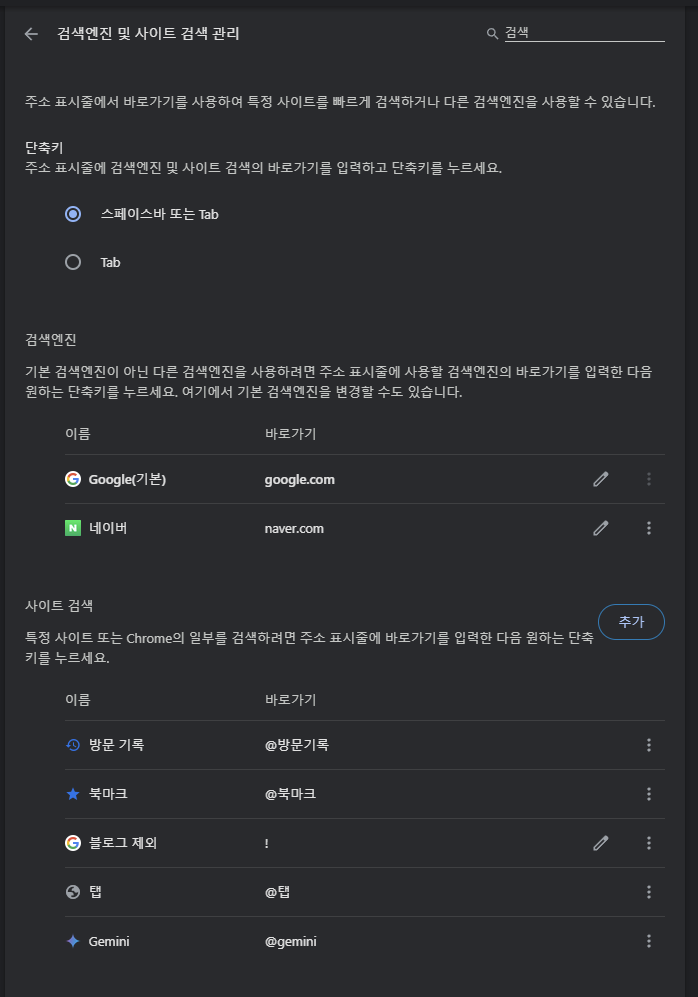
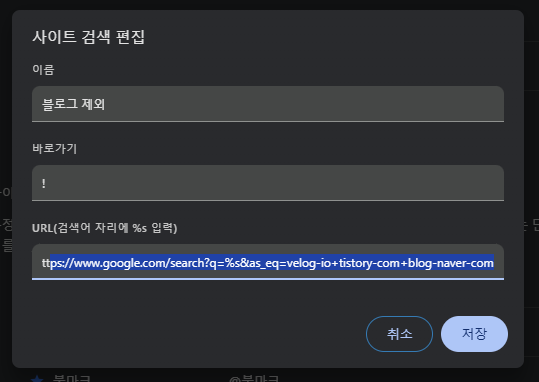
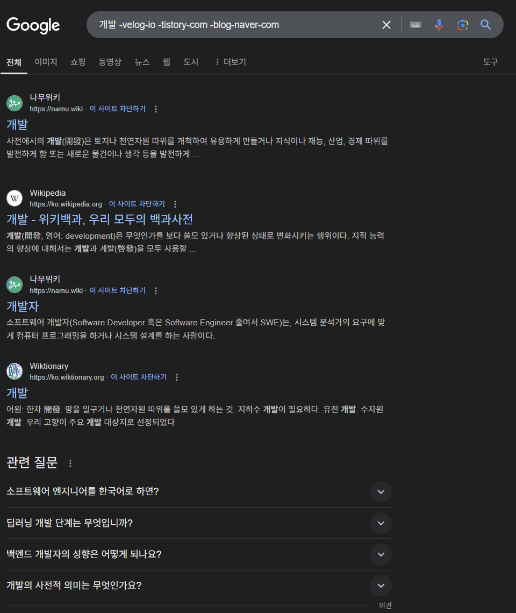

## 검색의 불편함

검색을 하다보면, 특정 사이트에서만 검색을 하고 싶거나 반대로 특정 사이트를 제외하고 싶을 때도 있습니다. 예를 들어 사진을 찾는데 pinterest 사이트를 제외하고 싶을 수 있고, 신뢰할 수 있는 정보를 찾기위해 velog, tistory, medium 등의 블로그를 제외하고 싶을 수 있습니다.

### 구글 고급 검색 사용하기

구글에서는 이러한 고급 검색을 제공합니다. [구글 고급 검색](https://www.google.com/advanced_search) 페이지에서 원하는 조건을 설정하고 검색을 하면 됩니다. 하지만 매번 고급 검색의 설정을 입력해야 하는 것은 귀찮은 일입니다. 이 때는 고급 검색 설정에 대한 쿼리 파라미터를 포함한 구글 고급 검색 페이지를 북마크하여 사용할 수도 있습니다. 하지만 매번 이 페이지로 이동해서 검색을 하는 것은 여전히 번거롭습니다. 

### 크롬 확장 프로그램 사용하기

`uBlacklist`과 같은 크롬 확장 프로그램을 사용할 수도 있습니다. 이 확장 프로그램은 검색에는 관여하지 않으며, 단순히 검색 결과에서 차단한 사이트를 숨겨 줍니다. 클라이언트 측에서 모든 것을 처리하기 때문에 자유도는 더 높지만, 아래의 경우와 같이 차단한 사이트의 검색 결과가 많을 경우 보여야 할 검색 결과보다 숨긴 검색 결과가 많아져 한 페이지에 표시되는 검색 결과가 매우 적어질 수 있습니다. 결과적으로 좋지 못한 사용자 경험을 낳게 됩니다.

#### 크롬 확장의 장점

자바스크립트를 사용해 클라이언트 측에서 프로그래밍적으로 필터링을 하므로 정규식을 통해 더 구체적이고 다양하게 필터링 조건을 걸 수 있습니다. ui를 통해 쉽게 사이트를 차단하고 관리할 수 있습니다

#### 크롬 확장의 한계

사용자가 구글 검색을 했을 때  -site: 파라미터를 통해 사이트를 제외하면 더 좋은 검색 결과를 만들 수 있을 것 같지만 확장 프로그램이 이렇게 밖에 할 수 없는 이유도 있습니다. 브라우저의 개인정보 보호가 엄격해지면서 Manifast v3에서는 여러 가지 제약이 많아졌습니다. 요청을 차단하기 어려워졌고 리디렉션을 하기 위해 rules를 도입하여 동적인 리디렉션이 더 어려워졌습니다. 그래서 이 글의 사례와 같이 이렇게 클라이언트 측에서 처리할 수 밖에 없는 한계점이 존재합니다

### 크롬의 검색 엔진 기능 이용하기

크롬 브라우저는 검색엔진 기능을 지원합니다. 이는 주소창에서 입력한 결과를 특정 url로 이동시키는 기능입니다. 일반적으로는 구글 검색을 이용하여 `google.com/search?q=%s`로 이동합니다. 

검색엔진에는 사용자가 원하는 검색엔진을 추가할 수 있습니다. 이 때 쿼리 파라미터를 사용하여 고급 검색의 기능을 사용할 수도 있습니다. 아래에서 URL은 블로그의 검색 결과를 제외하기 위해 as_eq 파라미터를 활용했습니다.

예시 URL: `https://www.google.com/search?q=%s&as_eq=velog-io+tistory-com+blog-naver-com`

이렇게 설정하고 저장을 완료하면 주소 표시줄에서 **!**를 입력하고 단축키인 스페이스바 또는 Tab를 누를 경우 해당 기능을 사용할 수 있습니다. 

이제 블로그 제외 검색이 활성화되면 검색어를 입력하고 엔터를 입력하면 정해둔 URL을 사용하여 구글 검색 페이지로 이동하게 됩니다

#### 검색엔진 기능의 장점

구글 검색의 기능만을 활용하기 때문에 서드파티 확장 프로그램을 사용하지 않아 더 안전합니다. 확장 프로그램이 아닌 구글이 검색 결과를 온전히 관리합니다.

#### 검색엔진 기능의 한계

특정 조건을 추가하거나 변경하기 위해 매번 브라우저 > 설정 > 검색엔진으로 이동하여 해당 URL을 교체해야 합니다. 따라서 자주 추가하거나 변경해야 하는 경우 크롬 확장이 더 편할 수 있습니다. 
