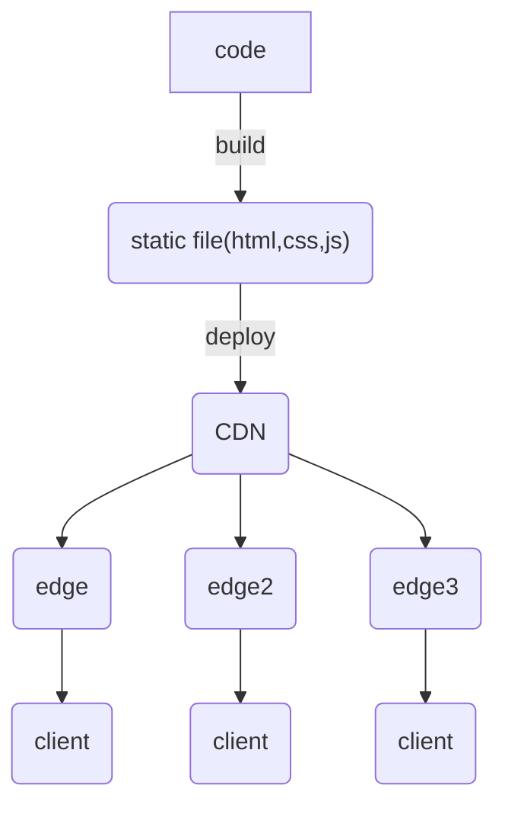
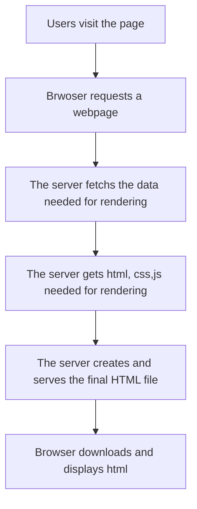
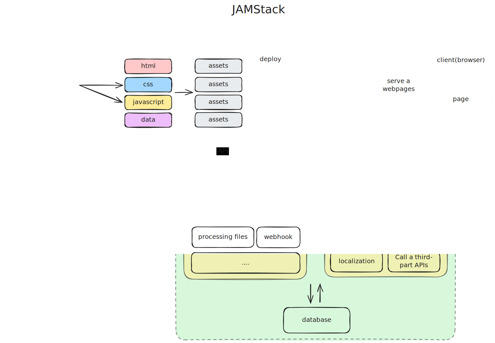

## 용어

- "정적이다": 페이지가 변경되지 않음 = 변경되지 않는 정적 파일(html, css, javascript)
- "동적이다": 페이지가 새로 고침될 때 변경될 수 있다. 즉석하여 생성될 수 있다. 던 캐싱된 경우 캐싱된 버전을 사용할 수 있다)
- 렌더링: javascript와 html,css를 이용하여 브라우저에 표시하기 위한 최종 html 문서로로 변환하는 작업

## 정적 사이트 생성(SSG)

정적 렌더링은 **빌드 시점**에 각 URL에 해당하는 페이지를 미리 렌더링하여 정적 파일로 저장하고 이를 제공하는 방식이다. 

### 장점

- **빠른 속도**: 미리 생성된 html 파일을 즉각 제공하여 응답 시간이 빠르다
- **높은 보안성**: 동적인 데이터 처리 및 컨텐츠가 없으므로 비교적 공격 표면이 작다.
- **높은 확장성**: CDN을 통해 전 세계에 빠르게 제공하고 보안성과 확장성을 가진다
- **쉬운 유지보수**: 서버는 단순히 파일을 제공하기만 하므로 부하가 적다
- **적은 비용**: 서버에서 처리할 작업이 거의 없어 비용이 적고, 무료 호스팅 서비스를 사용할 경우 서버를 관리할 필요가 없다. 

### 단점

- **동적 컨텐츠의 어려움**: 동적인 컨텐츠를 다루기 어렵다: 생성된 페이지에 대해 데이터 변경이 발생한 경우 이를 적용하기 어렵다
- **긴 빌드 시간**: 생성해야 할 페이지가 늘어날수록 빌드 시간이 증가할 수 있고, 저장해야 할 스토리지의 용량도 늘어난다

## 서버 측 동적 렌더링(SSR)

**클라이언트가 요청할 때마다** 각 요청에 맞는 페이지를 그때 그때 서버에서 렌더링하여 제공하는 방식. 서버에서 렌더링을 수행하여 관련 자바스크립트를 클라이언트에 전송하지 않아도 된다

## 장점

- **완전한 요청에 응답**: 사용자의 요청에 따라 다른 렌더링 결과를 보여줄 수 있다( headers, cookie, body, querystring, params 등)
- **실시간 데이터 대응 가능**: 렌더링에 데이터 베이스의 최신 데이터를 사용해야 하는 경우
- **서버 측 인증**: 서버 측에서 사용자 권한에 따라 다른 결과를 보여줘야 하는 경우

### 단점

- **서버 부하 증가**: 서버에서 실시간 데이터를 처리하고 그에 맞게 렌더링해야 하므로 응답 시간이 더 느릴 수 있다
  - 데이터 가져오기, 컴포넌트 렌더링, 페이지 렌더링 등에 적절한 캐싱 전략을 사용하여 개선할 수 있다
- **서버 비용 증가**: 서버에서 데이터 처리와 렌더링을 모두 담당하므로 SSG 방식에 비해 서버 비용이 많이 증가할 수 있다.

## 클라이언트 측 렌더링(CSR)

브라우저에서 자바스크립트를 사용하여 페이지를 직접 렌더링. 애플리케이션 규모가 커질수록 제공해야 하는 자바스크립트 크기가 늘어나므로 결과적으로 렌더링까지의 시간이 길어질 수 있다. **코드 분할(code splitting)**, **지연 로딩(lazy loading)**과 같은 방법을 사용하여 필요한 자바스크립트만 제공할 수 있다

### 장점

- **사용자 경험**: 클라이언트 측에서 대부분이 렌더링되어, 초기 로딩 이후부터는 페이지 이동 시에 거의 지연시간이 없어  부드러운 사용자 경험을 제공할 수 있다
- **동적 데이터 처리**: 클라이언트 측에서 데이터를 가져오고 이를 렌더링하는 방식으로 동적 데이터를 처리할 수 있다
- **서버 부하 감소**: 렌더링, 데이터 가져오기 등 많은 작업들이 클라이언트 측에서 수행되어 서버 측의 부하가 감소한다

### 단점

- **SEO의 어려움**: 초기 로딩 시 최소한의 html만을 제공하기 때문에 검색 엔진이 제대로 크롤링하기 어려울 수 있다. 다만 최신 검색 엔진들은 자바스크립트를 어느 정도 활용할 수 있다 https://developers.google.com/search/docs/crawling-indexing/javascript/dynamic-rendering?hl=ko
- **긴 초기 로딩 시간**: 클라이언트 측에서 렌더링이 진행되므로 다운로드 해야 하는 자바스크립트가 많아지고 렌더링까지 해야 하므로 처음에 로딩되는 시간이 길어질 수 있다
- **자바스크립트 의존**: 자바스크립트를 사용해 클라이언트 측에서 렌더링 해야 하므로 클라이언트 측의 성능에 따라 웹사이트 성능이 느려질 수 있고, 자바스크립트를 지원하지 않는 경우 웹사이트를 이용하기 어려울 수 있다

## 증분 정적 재생성(ISR)

SSG의 장점과 SSR의 장점을 합친 방식으로, 빌드 시점에 페이지를 정적으로 생성하고 캐싱한 다음 특정 페이지에 대해서  캐싱 만료 시간을 정하거나 캐싱 만료 요청을 받으면 해당 페이지를 다시 생성하여 제공하는 방식

### 장점

- **동적 컨텐츠 사용 가능**: 페이지의 캐싱 주기나 캐싱 만료 api를 통해 페이지 내의 컨텐츠가 변경되면 페이지를 재생성하여 페이지가 동적 컨텐츠를 지원하도록 할 수 있다
- SEO나 빠른 로딩 속도와 같은 SSG의 장점을 유지할 수 있다

### 단점

- 적절한 캐싱 전략을 세우지 않으면 예상하지 못한 결과를 초래할 수 있다
- SSG의 단점인 "긴 빌드 시간" 문제는 동일하다

## SSR with hydration

SSR 방식과 CSR 방식이 혼합된 방법. 서버에서 초기 html을 렌더링하고(SSR), 클라이언트 측에서 자바스크립트를 사용하여 대화형으로 전환(CSR). 초기 html을 통해 빠르게 페이지를 볼 수 있다. 첫 페이지 탐색 시에 SEO 장점을 유지 하면서 이후부터는 CSR 방식으로 사용되어 부드러운 사용자 경험을 줄 수 있다

## 정적 생성 사이트를 먼저 고려해야 하는 이유

- SSR은 서버 부하가 많다.
- SSR은 보안을 더욱 신경써야 한다
- SSR은 생각보다 더 비싸다
- SSG를 먼저 사용하고, 실시간 데이터가 필요한 일부분에 대해 클라이언트 측에서 렌더링(CSR)하도록 할 수 있다

## JAMStack

JAMStack은 웹 개발 아키텍처 중 하나이다. 사용자 인터페이스(UI)를 백엔드와 분리한다. 분리된 프론트엔드는 빌드 타임에 모든 페이지(마크업)를 정적으로 생성하고, CDN을 통해 전세계에 배포하여 사용자에게 빠르게 제공한다. 페이지에서 필요한 동적인 콘텐츠는 **자바스크립트**를 사용하여 API를 통해 백엔드와 통신하여 주고 받는다

- javascript: 클라이언트 측에서 동적인 데이터를 다루고 렌더링하기 위해 사용한다
- api: 백엔드 서버 및 외부 서비스와 통신하기 위해 프론트엔드 측에 api 형태로 제공된다
- markup: 빌드 시에 미리 생성되고 CDN에 배포된다

### 장점

- 높은 성능: 모든 페이지를 CDN에 배포하여 사용자는 빠르게 페이지에 접근 가능
- 보안성: 프론트엔드가 서버(CMS)와 완전히 분리되어 공격하기 어려움
- 개발 용이: 프론트엔드와 백엔드가 완전히 분리되어 각 분야의 전문가가 자신의 역할에만 집중
- 유연성: JAMStack에 사용되는 다양한 도구들은 쉽게 교체하거나 추가하여 상호 운용 가능하도록 설계

## 정적 사이트 생성기 비교

## 정적 사이트 배포 플랫폼

- Netlify: `[subdomain].netlify.app` 도메인을 사용
- Cloudflare Pages: `[subdomain].pages.dev` 도메인을 사용
- Github Pages `[user-id].github.io/repository` 도메인을 사용
- Vercel: `[subdomain].vercel.app` 도메인을 사용