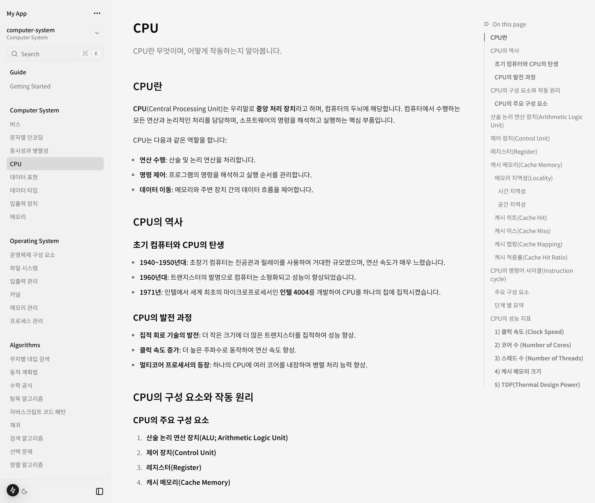
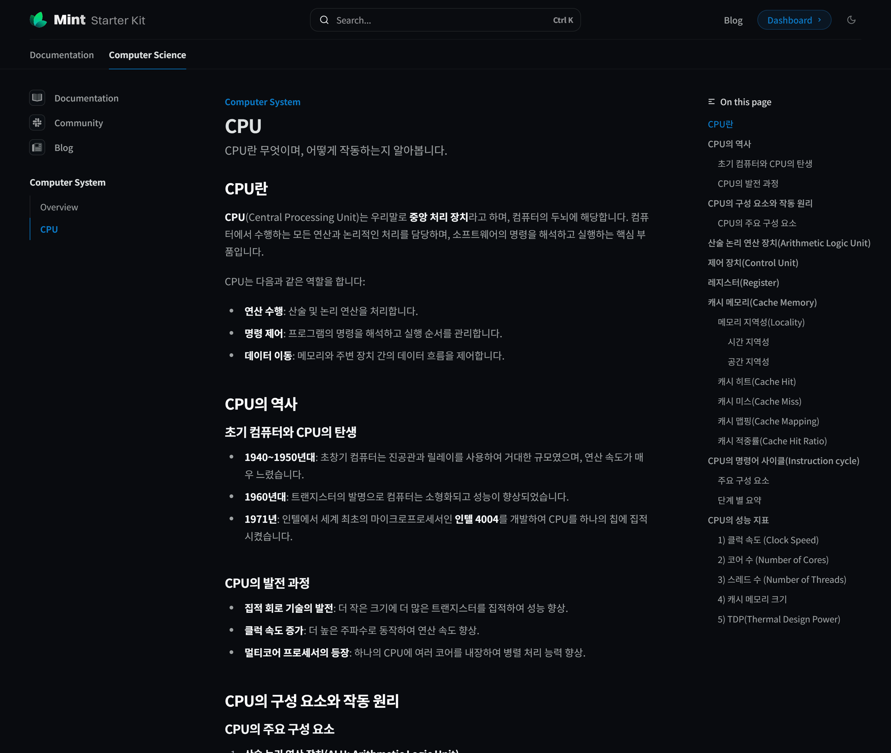

## 개인용 문서 저장소가 필요한 이유

학습을 위해 또는 기록을 위해 사람들은 여러 도구를 통해 문서를 작성하고 나름대로 저장합니다. 학생 때는 보통 공책을 사용하여 필기하였습니다. 그리고 늘어나는 디지털 컨텐츠(사진, 동영상, 문서, 그래프) 등을 모두 공책으로 옮기기에는 한계가 있었습니다. 그래서 디지털 문서를 저장할 수 있는 공간이 필요했습니다. 처음에는 한글과 MS Word를 사용해 문서를 작성하듯이 저장했습니다. 이것의 문제는 다른 플랫폼과의 호환성이 매우 떨어진다는 것이고, 공유하기 위해서는 파일로 보내야하며, 상대방도 해당 프로그램을 설치해야만 문서를 열 수 있었습니다. 그러다 개발을 시작하면서 마크다운(Markdown)을 접하게 되었습니다.

## 마크다운을 사용하다

마크다운은 텍스트 기반의 경량 마크업 언어로, 쉽게 읽고 쓸 수 있으며, HTML로 변환이 가능합니다. 종종 WYSIWYG를 통해 문서를 작성하는 리치텍스트 방식과 비교되기도 하지만, 위지윅은 별도의 에디터가 거의 필수적인 반면, 마크다운은 에디터를 활용할 수도 있고 텍스트 에디터만 있어도 작성이 가능합니다. Github는 마크다운에 대한 미리보기를 지원하며 REAEME라고 하는 리포지토리의 설명을 작성할 때도 사용됩니다. 그리고 gitbook, notion, velog, tistory, medium 등의 플랫폼에서도 마크다운을 지원합니다. 최근에는 옵시디언(Obisidian)과 같은 개인용 노트 툴이 인기를 얻으면서 마크다운을 지원하는 툴이 더욱 늘어나고 있습니다.

## 마크다운의 호환성

마크다운은 여러가지 에디터 라이브러리를 지원합니다.

- ToastUI Editor: 한국의 NHN이 만든 에디터로, 마크다운과 WYSIWYG를 지원합니다.

- Lexical: facebook에서 만든 마크다운 헤드리스 에디터로 커스터마이징에 용이합니다.

- TipTap: 헤드리스 에디터로 프레임워크에 독립적이며, 100개 이상의 확장을 제공합니다.

마크다운은 쉽게 구문 분석이 가능하며, 다른 포맷으로 변환하기도 쉽습니다.

- remark: markdown을 AST로 변환하는 라이브러리로, 플러그인 시스템을 통해 마크업을 쉽게 변경할 수 있습니다.

- mdx: markdown과 JSX를 함께 사용할 수 있는 라이브러리로, React 컴포넌트를 마크다운에 삽입할 수 있습니다.

- front-matter: markdown의 메타데이터를 추출하는 라이브러리로, markdown의 메타데이터를 추출하여 사용할 수 있습니다.

- katex: 수학식을 렌더링하는 라이브러리로, 수학식을 마크다운에 삽입할 수 있습니다.

- mermaid: 다이어그램을 그리는 라이브러리로, 다이어그램을 마크다운에 삽입할 수 있습니다.

## Gitbook으로 문서를 배포하다

Gitbook을 처음 접한 것은 이름 때문이었을지도 모릅니다. Git과 book이 합쳐져 있으니 마치 Github에서 제공하는 서비스인 것 같아서 사용해보았습니다(실제로 Gitbook은 다른 회사에서 만들었습니다). Gitbook은 마크다운을 사용하여 문서를 작성하고, 이를 웹페이지로 배포할 수 있는 서비스입니다. 혼자서 사용한다면 무료로 사용할 수 있고, 무엇보다 문서를 배포하기 위해 단지 Github를 연동하기만 하면 되어 매우 편리했습니다. 커스터마이징도 웹에서 쉽게 바꿀 수 있고, 블록 기반의 웹 에디터도 제공하여 어디서나 편집하고 배포할 수 있었습니다.

*Gitbook은 루트의 SUMMARY.md 파일을 읽어 문서의 구조를 파악하고, 이를 기반으로 문서를 배포합니다.*

Gitbook에는 단점이 몇 가지 있었습니다. 먼저 Github와 Gitbook 간의 양방향 동기화는 처음에는 매우 편리했지만, 섞어서 쓰다보니 변경 사항을 예측하기 어려웠습니다. Gitbook에서 특정 부분을 수정했을 때 실제로 Github에는 어떻게 반영될지 예측하기 어려웠습니다. 그리고 Gitbook은 무료로 사용할 수 있지만, 특정 기능을 사용하기 위해서는 유료로 전환해야 했습니다. 기존의 폰트는 한글을 지원하지 않는데 이를 변경하기 위해서는 유료로 전환해야 했습니다(유료 폰트에도 한글 폰트가 없었습니다). 그리고 웹에디터에서 한글을 사용할 때 간헐적으로 커서가 옮겨지는 [문제](https://www.facebook.com/groups/engfordev/posts/3099956006722870/)가 있었습니다. 이 문제는 몇 년 전에 이미 제출 되었지만, 2025년에도 해결되지 않았습니다. 유료 서비스를 제공하는 곳에서 다른 에디터에서는 발생하지 않는 문제를 몇 년이나 방치한다는 것이 이해가 되지 않았습니다.

.png)

## FumaDocs 사용해보기

유료 서비스의 한계와 커스터마이징의 불편함으로 인해 직접 문서 사이트를 만들기 위해 평소 자주 사용하는 Next.js로 구현된 사이트들을 살펴보았습니다. Nextra, docusaurus, FumaDocs 등을 살펴보았고, 최종적으로 Nextra보다 더 나아 보이는 FumaDocs를 선택하였습니다. FumaDocs는 Next.js을 기반으로 여러 가지 기본 컴포넌트와 기능을 통합하여 제공합니다. Turbo, nuqs 등에서 공식 문서를 배포하기 위해 사용하고 있어서 충분히 매력적으로 보였습니다.

FumaDocs는 크게 부족한 것이 없었습니다. Nextjs 프로젝트 기반이기 때문에 사용자가 원하는대로 커스터마이징이 가능합니다. 유일한 단점은 Next.js 프로젝트를 관리해야 한다는 것이었습니다. 문서 리포지토리를 순수하게 문서만 관리하고 싶었지만, Next.js 프로젝트를 관리해야 하는 것이 조금 아쉬웠습니다. 계속 관리할 수 있을까 걱정이 되었습니다.

## Mintlify 사용해보기

Mintlify를 처음 알게 된 것은 FumaDocs의 공식 문서에서 였습니다. 공식 문서에는 "Fumadocs는 Mintlify만큼 강력하지 않습니다"라고 소개되어 있었습니다. Mintlify는 Gitbook과 비슷한 문서 호스팅 서비스로 컴포넌트, 웹 에디터, 호스팅 등을 제공합니다. Nextjs를 기반으로 빌드되고 커스텀 폰트를 무료 기능으로 제공합니다. Mintlify 기능을 볼 때까지는 그렇게 매력적으로 보이지는 않았지만, 사용하고 있는 기업이 많다는 것이 호기심을 불러일으켰습니다. Cursor, Resend, upstash 등에서 사용하고 있다고 공식 사이트에서 소개하고 있었습니다. 그런데 홍보에는 사용되지 않았지만, Mintlify를 사용하고 있는 회사가 또 있었는데 [X Docs](https://docs.x.com)였습니다. X Docs는 X에서 만든 문서 사이트로, Mintlify를 사용하고 있었습니다. X는 구 트위터로 이렇게 큰 회사가 Mintlify를 사용하고 있다는 것이 신기했습니다.

## Mintlify로 이전하기
