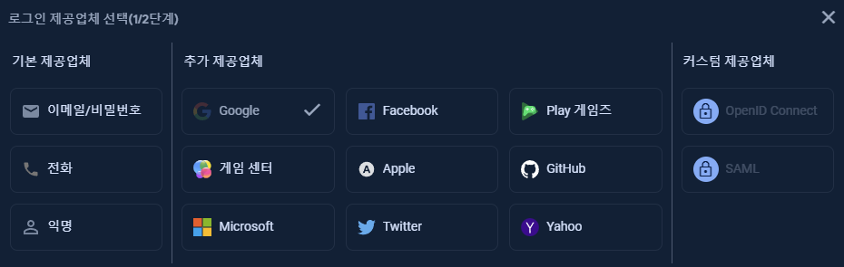
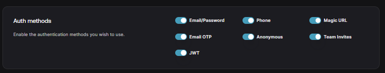
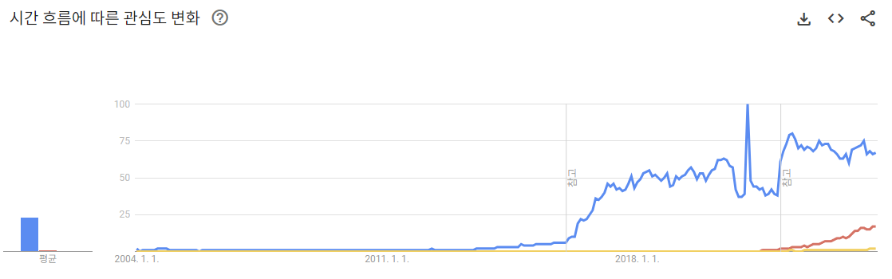

## Firebase

- Google에서 만든 서비스로 웹 및 모바일 앱을 제작하기 위한 도구들을 제공
- 데이터베이스로 `Firestore`를 사용하며 키:값 쌍의 컬렉션으로 이루어진  "문서" 단위로 데이터를 저장한다.
- 내부적으로는 GCP(Google Cloud Platform)를 사용한다
- 프로젝트를 많이 만들 수 있다

https://firebase.google.com/pricing

## Supabase

- 자칭 **Firebase 대안**으로 부르는 오픈소스 기반 서비스.
- 데이터베이스로 RDB의 한 종류인 PostgreSQL을 사용한다.
- 오픈소스 기반으로 종속성이 없다
- 고전적이고 가장 널리 사용되는 SQL을 사용하여 데이터 베이스를 쿼리할 수 있다
- 최대 2개의 활성 프로젝트

https://supabase.com/pricing

## Appwrite

앱라이트에 대한 설명

https://appwrite.io/pricing

## Auth

인증 기능은 사용자의 로그인을 관리하고, 사용자의 정보를 저장하며, 사용자의 권한을 관리하는 기능입니다.

### Firebase

- MAU: 50,000

제공 업체만 보면 가장 적으나 이메일이나 전화와 같이 기본적인 방법들을 제공하고, Google 로그인이 기본으로 제공되어 별다른 설정 없이 바로 사용할 수 있다

### Supabase

- MAU: 50,000

Email부터 Google, Github, Apple 등 다양한 방법을 지원한다. 독특하게도 해외 서비스 임에도 **'Kakao 로그인'**을 지원한다

### Appwrite

- MAU: 75,000

30개 이상의 다양한 로그인 방법 지원

## Database

데이터베이스는 데이터를 저장하고 관리하는 기능입니다.

### Firebase

- 1 GiB 용량
- 아웃 바운스 10GiB/월
- 쓰기 작업 20,000/일
- 읽기 작업 50,000/일
- 삭제 작업 20,000/일

### Supabase

- 전용 데이터베이스
- 500 MB 용량
- 대역폭 5GB
- 무제한 API 호출
- 일주일 간 활동이 없으면 일시정지

### Appwrite

- 프로젝트 당 1개
- 무제한 문서
- 읽기 및 쓰기 무제한

## Storage

스토리지는 파일을 저장하고 관리하는 기능입니다.

### Firebase

- 5GB 용량
- 다운로드 1GB/일
- 업로드 작업 20,000/일
- 다운로드 작업 50,000/일
- 이미지 변환은 유료 요금제 사용 시 확장프로그램을 통해 사용 가능

### Supabase

- 1GB 용량
- 최대 업로드 사이즈 50MB
- 이미지 변환은 유료 플랜만 가능

### Appwrite

- 스토리지 2GB
- 대역폭 10GB
- 프로젝트 별 최대 3개의 버킷
- 최대 업로드 사이즈 50MB
- 이미지 변환 무제한

## Functions

함수는 서버리스 함수를 만들고 실행하는 기능입니다.

### Firebase

- Blaze 요금제 사용 시 월 2,000,000 건 무료

- Blaze 요금제 사용 시 월 400,000 GB/초 무료

- Blaze 요금제 사용 시 월 200,000 CPU/초 무료

  Blaze 요금제 사용 시 아웃 바운드 5GB/월 무료

### Supabase

- 월 500,000 건 무료
- 최대 25개 함수 사용 가능

### Appwrite

- 월 750,000 건 무료
- 프로젝트 당 5개 함수 사용 가능

## Realtime

실시간 데이터베이스는 데이터베이스에 저장된 데이터를 실시간으로 동기화하는 기능입니다.

### Firebase

- 최대 동시 연결: 100
- 저장 용량: 1GB
- 다운로드 용량: 10GB/월

### Supabase

- 최대 동시 연결: 200
- 메시지 사용 가능 횟수: 200만/월
- 최대 메시지 크기 250KB

### Appwrite

- 최대 동시 연결: 250
- 메시지 사용 가능 횟수: 300만/월

## 비교

- 파란색: Firebase는 GCP와의 함께 사용되어 구글 서비스와 통합이 쉽고, 종량제 요금제를 통해 무료 한도가 넘더라도 사용한 만큼 적은 요금제로도 운영이 가능하다. 또한 오래 서비스되어 온 만큼 커뮤니티나 자료가 많다
- 빨간색: Supabase는 postgresql을 데이터베이스로 선택하여, 관계형 데이터베이스를 다룰 줄 아는 사람에게는 더 친숙하다. 테이블 타입을 타입스크립트로 내보낼 수 있으며, 이는 타입스크립트 환경에서 더 좋은 개발 경험이 될 수 있다
- 노란색: Appwrite는 아직 인지도가 적고 사용자나 정보가 많이 없는 편이다. 가장 넉넉한 요금제를 제공한다

## 결론

- 검색이 필요없거나 nosql로 충분하다면? Firebase
- 전체 텍스트 검색이 필요하고 관계형 데이터베이스에 익숙하다면? Supabase
- 정보가 많이 없어도 잘 사용할 수 있고 무료 요금제의 용량이 중요하다면? Appwrite

------

https://github.com/firebase

https://github.com/supabase

https://github.com/appwrite