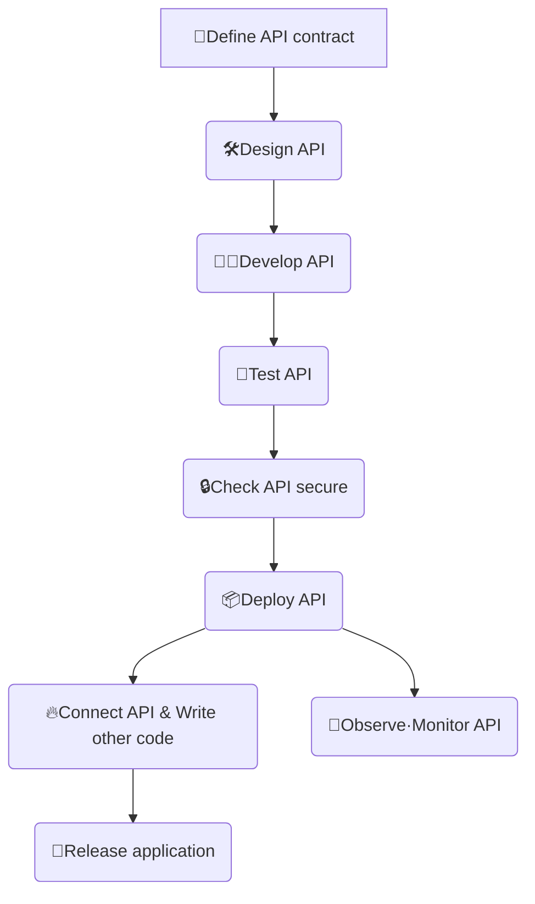
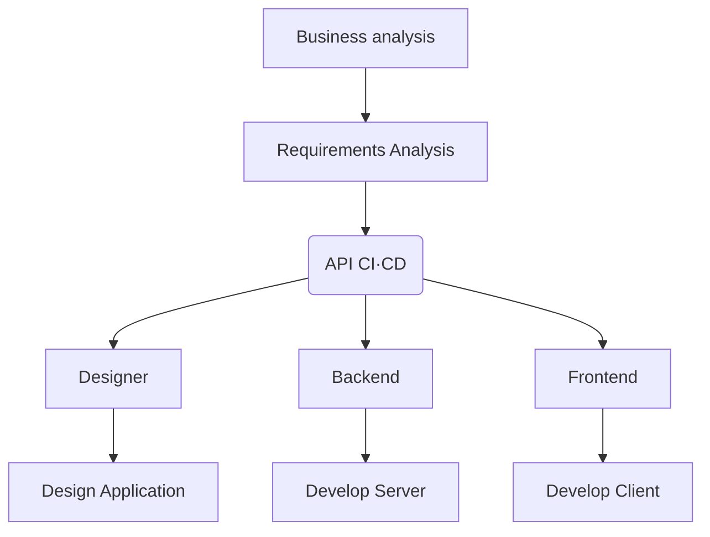

## API 개발 시 생기는 문제점

### 백엔드와 프론트엔드 간 동기화 문제

- 서로의 변경사항을 파악하기 어려움
- 변경사항을 반영하기 어려움

해결 방법

1. 대화(구두) 또는 메신저로 소통하기
   1. 비용이 많이 들어간다
   2. 대화를 한 번 놓치면 따라가기 어렵다
   3. 시간 순으로 나열 되는 특성 상 정리하기 어렵다
2. 사내 위키를 만들어 공동 편집
   1. 위키와 API 간의 동기화 문제가 다시 발생한다
   2. 매번 위키에 API 변경사항을 반영해야 한다
   3. API를 테스트하기 어렵다
3. 대중적으로 널리 쓰이는 Postman의 [Collections](https://www.postman.com/collection/) 활용하기
   1. Postman에 의존적이다 -> 당연하게도 개인은 무료지만 4명 이상의 팀 협업은 유료이다
   2. 컬렉션을 직접 관리해야 한다

## API first란 (API 우선 접근 방식)

API 우선 접근 방식은 소프트웨어 개발 프로세스의 시작 부분에서 API를 우선 순위로 하는 접근 방식이다. 먼저 비지니스 이해 관계자와 협력하여 API를 설계하는 것으로 시작한다. 설계된 API는 팀원들과 API 리뷰를 하고 리뷰를 통과한 API는 테스트 및 보안 검사를 거치고 배포를 하게 된다. API가 배포가 완료되면 팀원들은 API를 기반으로 병렬적으로 서비스를 구축하게 된다.

- ✅애플리케이션이 지원하는 API를 우선시
- ✅비즈니스에 제공할 수 있는 가치에 집중
- ✅애플리케이션이 내부·외부 애플리케이션과 원활하게 통합

## API 유형

- internal APIs: 같은 회사 내부에서 사용하는 API
- public APIs: 공개된 API
- partner APIs: 제휴사와 연동되는 API
- exposed APIs: 외부에 노출되는 자사의 API

### Internal API - Private API(internal)

- 단일 조직 내에서 서로 다른 소프트웨어 구성 요소를 연결하는 데 사용됨
- 제 3자가 사용할 수 없음
- 일부 애플리케이션에는 수십 개에서 수백 개의 비공개 API가 포함될 수 있음
- 예시
  - 마이크로 서비스와 같이 여러 [내부 서비스 간 통신](https://learn.microsoft.com/en-us/dotnet/architecture/microservices/architect-microservice-container-applications/communication-in-microservice-architecture)이 필요할 때
  - 인사 관리 시스템과 같이 조직 내 데이터를 다루는 애플리케이션 간 통신

### Exposed API - Public API (공개 API)

- 조직의 데이터, 기능 또는 서비스에 대한 공개 액세스를 제공
- 타사 애플리케이션에 통합 가능
- 일부 공개 API는 무료로 제공되며, 다른 일부는 유료 제품으로 제공됨
- 예시
  - [페이스북](https://developers.facebook.com/), [트위터](https://developer.x.com/) 등 공개된 소셜 미디어 API
  - 공공 데이터를 누구나 사용할 수 있도록 공개된 [공공데이터포털](https://www.data.go.kr/)

### Exposed API - Partner API (파트너 API)

- 두 개 이상의 회사가 데이터 또는 기능을 공유할 수 있게 함
- 일반 대중이 사용할 수 없고 회사 간 제휴를 맺음
- 접근을 제한하기 위해 인증 메커니즘을 활용
- 예시
  - 금융권과 같이 민감한 데이터를 다루는 경우 제휴를 맺고 사용하는 [신한은행 API 마켓](https://api.shinhan.com/shbaas/home)

## API first의 장점

### 생산성 향상

API 문서, 관리, 테스트를 중앙집중화하여 누구나 API에 쉽게 접근할 수 있다. 개발자 및  디자이너, 기획자 등 팀 내 구성원은 API가 만들어진 후 병렬적으로 함께 프로세스를 이어나감으로써 빠르게 제품을 만들 수 있다. id값이 string 타입인지, number타입인지 또는 특정 필드가 nullable한지 등 타입이나 네이밍에 대해서 백엔드와 프론트엔드 간 사소한 문제가 발생하지 않는다.

### 소프트웨어 품질 향상

API 기획과 리뷰에 백엔드 개발자만 참여하는 것이 아니라 팀 구성원 모두가 참여하여 더 나은 API를 만들 수 있다. API 테스트 및 배포를 자동화하여 운영 품질을 높이고 문제를 발견했을 때 빠르게 API를 수정하고 배포하는 반복 가능한 프로세스를 구축할 수 있다.

------

https://www.postman.com/api-first/

https://blog.postman.com/why-should-you-be-an-api-first-company/

https://blog.postman.com/many-paths-to-api-first-choose-your-own-adventure/

https://www.postman.com/api-platform/api-lifecycle/

https://www.youtube.com/watch?v=J4JHLESAiFk

https://youtu.be/J4JHLESAiFk?si=_Kd99UjSQYWPSxwP

https://youtu.be/28Tz7gos5DQ?si=COpjSyLVI71dQrgH
