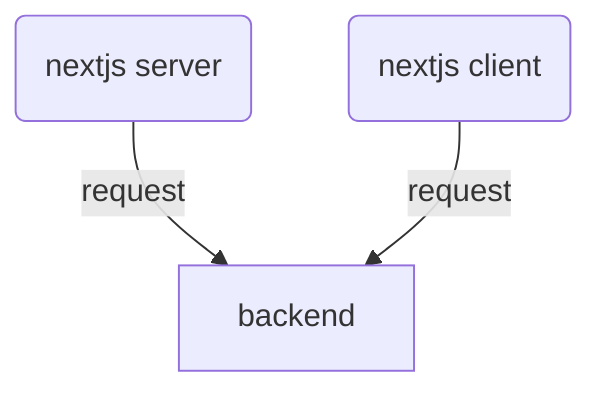
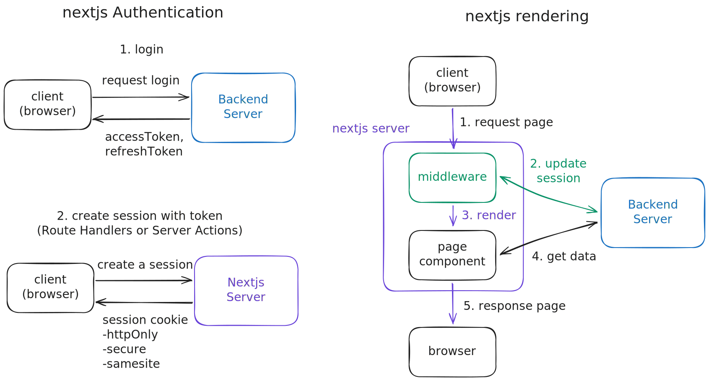

## 인증(Authentication)과 권한 부여(Authorization)란?

- 인증(Authentication): 사용자가 누구인지 확인하는 과정
  - 주로 로그인을 통해 사용자를 인증합니다.
  - 사용자의 아이디와 비밀번호를 확인하여 사용자를 인증합니다.
- 권한 부여(Authorization): 사용자에게 특정한 권한을 부여하는 과정
  - 인증된 사용자에게만 특정한 기능을 제공합니다.
  - 사용자의 권한을 확인하여 특정한 기능을 제공합니다.


## nextjs에서 페이지 요청 흐름

nextjs는 기존 react 앱과 달리  nextjs 서버가 존재하고 서버측 렌더링(SSR)을 지원합니다. 따라서 서버 측과 클라이언트 측 모두에서 백엔드 서버로 요청을 보낼 수 있습니다.




ssr 시 흐름은 다음과 같습니다. 

1. 브라우저에서 url을 접속하여 페이지를 요청한다
2. nextjs 서버에서는 들어 온 요청에 대해 미들웨어에서 세션을 업데이트하고 검증합니다
   1. 페이지 렌더링 중 세션이 만료되지 않도록 미리 세션을 업데이트 합니다
   2. 요청에 대한 권한이 존재하지 않으면 사용자를 로그인 페이지로 리디렉션합니다
3. 페이지 컴포넌트에서는 렌더링에 필요한 데이터를 백엔드 서버(또는 데이터베이스)로 요청합니다
4. 데이터를 받아서 페이지를 렌더링한 후 브라우저로 내려보냅니다

⚠️ 1. 브라우저에서 nextjs 서버로의 페이지 요청과 2. nextjs 서버에서 백엔드로의 데이터 요청은 서로 다른 요청으로 request, response를 공유하지 않습니다. 따라서 쿠키와 같은 request.headers도 공유되지 않습니다


## nextjs에서 쿠키 사용하기 

> [!WARNING]
> 페이지 컴포넌트(page.tsx)에서는 쿠키를 조작할 수 없습니다

따라서 nextjs 서버 측에서 백엔드 측에 인증된 요청을 보내기 위해서는 nextjs 서버 측에서 백엔드 서버로 요청을 보낼 때 인증 정보를 함께 보내야 합니다. 이때 인증 정보는 쿠키나 헤더에 담아서 보낼 수 있습니다. 클라이언트 측에서 온 요청의 쿠키를 꺼내서 서버 측에서 백엔드 서버로 요청을 보낼 때 쿠키에 담긴 인증 정보를 함께 보내는 방법이 일반적으로 사용되는 방법입니다.

- request에서 쿠키 가져와서 fetch 호출하기

```javascript
export async function middleware(request: NextRequest) {
    const response = await fetch("http://localhost:4000/api/v1/auth/refresh", {
    	method: "POST",
	    credentials: "include",
	    headers: {
    	    cookie: request.cookies.toString(),
    	},
	});
    ...
}

```

- request와 response에 쿠키 설정하기

response에 주입한 쿠키는 브라우저에 응답이 도달하면 브라우저에 저장됩니다. 

```typescript
export async function middleware(request: NextRequest) {
    request.cookies.set("accessToken", accessToken);
    response.cookies.set("accessToken", accessToken, {
        maxAge: 60 * 60, // 1 hour
        httpOnly: true,
        sameSite: "lax",
        secure: true,
    });
}

```

> [!NOTE]
> 페이지 컴포넌트에서 접근하는 cookie는 request의 쿠키 값입니다. 따라서 렌더링 중에 인증된 api를 사용하기 위해서 쿠키에 접근해야 한다면 request에도 쿠키를 넣어야 합니다


## nextjs에서 인증 구현하기


nextjs의 클라이언트 측과 서버 측 모두에서 토큰에 접근하기 위해서는 쿠키에 토큰을 저장하는 방법이 일반적으로 사용됩니다. 클라이언트 측에서 로그인을 수행하고 토큰을 서버 측으로 보내 저장하거나, 서버 측에서 로그인을 처리하고 토큰을 저장하도록 할 수 있습니다.



> [!TIP]
> 클라이언트 측에서 nextjs 서버 측으로 토큰을 보내는 방법은 route handler를 사용하거나 server actions를 사용하는 방법이 있습니다.

### 클라이언트 측에서 로그인하기

```tsx
// 클라이언트 측에서 로그인을 수행하고 토큰을 서버 측으로 보내 저장하는 방법

export default function LoginForm() {
    const [username, setUsername] = useState('')
    const [password, setPassword] = useState('')

    const handleSubmit = async (e) => {
        e.preventDefault()
        const response = await fetch('https://api.example.com/login', {
            method: 'POST',
            body: JSON.stringify({ username, password })
        })
        
        const { accessToken, refreshToken } = await response.json()
        // 1. route handler로 토큰을 보내는 방법
        // const saveTokenResponse = await fetch('/api/session', {
        //     method: 'POST',
        //     body: JSON.stringify({ accessToken, refreshToken })
        // })
        // 2. server actions를 사용하는 방법
        // await saveTokenToServer({ accessToken, refreshToken })

    }

    return (
        <form onSubmit={handleSubmit}>
            <input type="text" value={username} onChange={(e) => setUsername(e.target.value)} />
            <input type="password" value={password} onChange={(e) => setPassword(e.target.value)} />
            <button type="submit">Login</button>
        </form>
    )
}
```


### 서버 측에서 토큰을 사용해 인증된 api를 호출하는 방법

```tsx
// 서버 측에서 토큰을 꺼내 인증된 api를 호출하는 방법

export default async function Page() 
    const { accessToken } = getSession()
    const res = await fetch('https://api.example.com/data', {
        headers: {
           Authorization: `Bearer ${accessToken}`
        }
    })
    const data = await res.json()
    return <div>{data}</div>
}
```


### 클라이언트 측에서 토큰을 꺼내 인증된 api를 호출하는 방법

- context를 사용하여 서버 측에서 클라이언트 측으로 세션 전달
- useSession hooks를 사용하여 accessToken 가져오기

```tsx
// 클라이언트 측에서 토큰을 꺼내 인증된 api를 호출하는 방법

export default async function Page() {
    const { accessToken } = useSession()
    const postsQuery = useQuery({
        queryKey: ['posts'],
        queryFn: () => fetch('https://api.example.com/posts', {
            headers: {
                Authorization: `Bearer ${accessToken}`
            }
        }),
    })
    return (
        <div>
            {postsQuery.isLoading && <div>Loading...</div>}
            {postsQuery.isError && <div>Error: {postsQuery.error.message}</div>}
            {postsQuery.isSuccess && (
                <ul>
                    {postsQuery.data.map(post => (
                        <li key={post.id}>{post.title}</li>
                    ))}
                </ul>
            )}
        </div>
    )
}
```


### 미들웨어로 세션 갱신하기

- 페이지 컴포넌트에서 request, response에 접근(조작)할 수 없다
- 만약 페이지 컴포넌트에서 재인증이 필요하게 되면 이를 해결할 방법이 없다
- middleware에서 세션을 업데이트하면 페이지 컴포넌트 단계에서 대부분 인증을 유지할 수 있다

```typescript
// middleware.ts
// 서버 측에서 요청마다 세션을 업데이트. 
// 페이지 컴포넌트에서는 request, response에 접근하거나 조작할 수 없음
export function middleware(request: NextRequest) {
  return updateSession(request)
}

export const config = {
  matcher: [
    /*
     * Match all request paths except for the ones starting with:
     * - api (API routes)
     * - _next/static (static files)
     * - _next/image (image optimization files)
     * - favicon.ico (favicon file)
     */
    '/((?!api|_next/static|_next/image|favicon.ico).*)',
  ],
}
```

