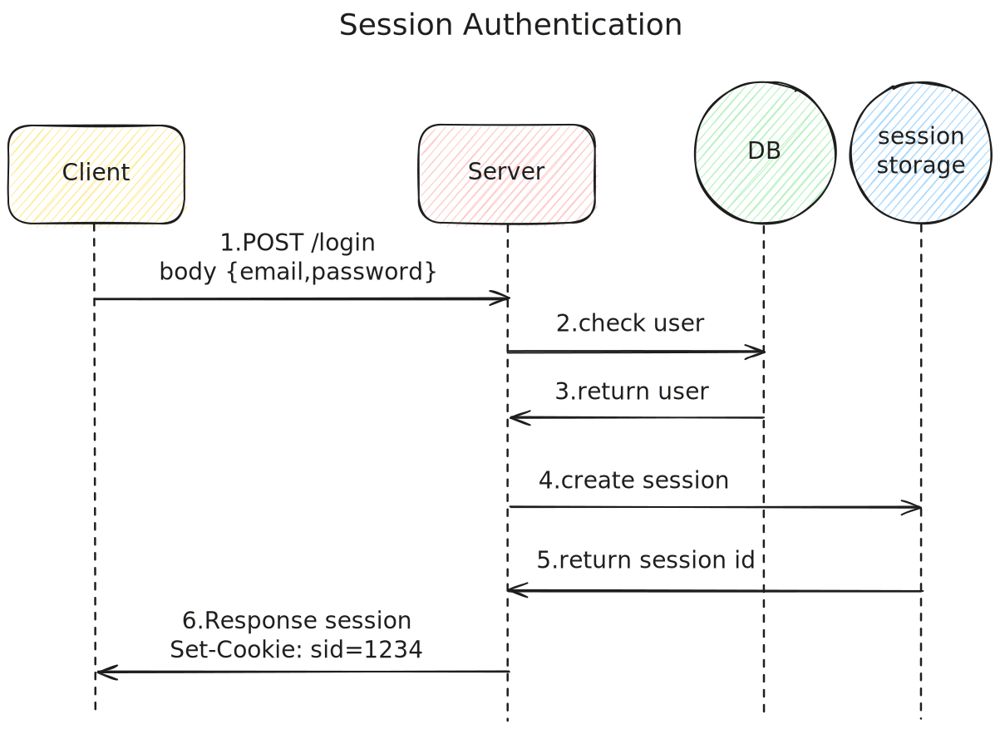

## 인증(Authentication)과 권한 부여(Authorization)란?

- 인증(Authentication): 사용자가 누구인지 확인하는 과정
  - 주로 로그인을 통해 사용자를 인증합니다.
  - 사용자의 아이디와 비밀번호를 확인하여 사용자를 인증합니다.
- 권한 부여(Authorization): 특정 사용자가 애플리케이션에서 액세스할 수 있는 범위에 대해 결정합니다
  - 인증된 사용자에게만 특정한 기능을 제공합니다.
  - 사용자의 권한을 확인하여 특정한 기능을 제공합니다.
- 세션 관리 - 요청 또는 사이트 방문 전반에 걸쳐 사용자의 인증 상태를 추적합니다
- 상태 비저장 세션 - 클라이언트 측에 세션 정보가 저장됩니다
- 데이터베이스 세션 - 세션 정보는 데이터베이스에 저장됩니다

HTTP는 무상태(stateless)이므로 로그인 상태를 유지할 수 없고, 사이트 내에서 유저를 추적할 방법이 없었습니다. 이러한 배경에서 쿠키는 사용자의 재방문을 확인하고 로그인 기능을 유지하기 위해 사용되었습니다

## 인증 구현 시 필요한 기능

✅로그인 - 사용자의 신원을 확인합니다

✅자동 로그인 - 자동 로그인은 권장되지 않지만, 포털 사이트와 같이 자주 접속해야 하는 일부 상황에서 효과적일 수 있습니다

✅로그아웃 - 사용자는 자신이 원하는 때에 로그아웃하고 인증 정보를 철회할 수 있어야 합니다

✅다른 세션에서 로그아웃 - 사용자는 원격으로 로그아웃이 가능해야 합니다

## 세션 관리

- 세션 정보의 암호화 및 복호화
  - 세션 데이터는 암호화되어 안전하게 관리되어야 합니다
- 세션 생성, 확장 삭제
  - 세션 생성 - 세션 세션 시 세션 ID를 할당하고 사용자에게 제공해야 합니다. 
  - 세션 무효화 -세션 을 무효화 하기 위해 클라이언트와 서버 양측은 적극적인 조치를 취해야 합니다. 클라이언트 측에서는 쿠키의 유효시간을 0 또는 과거 시간으로 설정하여 토큰 값을 지울 수 있습니다. 서버 측에서는 세션을 닫고 무효화 하기 위해 세션이 만료되거나 사용자가 로그아웃을 할 때 적절한 세션 관리를 해야 합니다.
  - 세션 자동 만료 - 주어진 세션 ID에 대한 마지막 HTTP 요청을 수신한 후 정의된 유후 시간이 지나면 세션을 만료하고 무효화합니다

- 세션 ID
  - 세션 ID는 고유해야 합니다
  - 세션 ID는 무차별 대입 세션 추측 공격을 방지하기 위해 `64bits` 이상의 엔트로피를 가져야 합니다(128bit 이상 권장)
  - 세션 ID의 일부가 랜덤하지 않은 경우 보안을 유지하기 위해 전체 길이를 늘릴 수 있습니다
  - 암호학적으로 안전한 의사 난수 생성기(CSPRNG)를 사용하여 통계 분석 기술을 통한 예측을 방지해야 합니다
  - 생성하지 않은 세션 ID를 절대 수락해서는 안 되며, 세션 ID를 수신하는 경우 사용자에게 새로운 유효한 세션 ID를 생성하여 제공해야 합니다
- 세션 ID 콘텐츠
  - 세션 ID는 클라이언트를 식별하기 위한 용도이며, 민감한 정보나 개인 식별 정보를 담지 않습니다
- 세션 저장소
  - 세션 저장소에는 세션에 대한 정보를 저장합니다
  - 클라이언트 IP 주소, 사용자 에이전트, 이메일, 사용자 이름, 사용자 ID, 역할, 권한 수준, 액세스 권한, 언어 기본 설정, 계정 ID, 현재 상태, 마지막 로그인, 세션 시간 초과 및 기타 내부 세션 세부 정보가 포함될 수 있습니다
- 세션 ID 교환과 쿠키
  - 웹 애플리케이션에서 세션 교환을 위해 쿠키를 사용하며, 쿠키는 `HttpOnly`, `Secure`,`SameSite`,`Domain` 속성을 사용하여 서버 측에서만 관리합니다
  - HttpOnly 속성: XSS 공격을 통한 세션 ID 도용을 방지하기 위해 사용합니다
  - Secure 속성: MitM 공격을 통한 세션 ID 도용을 방지하기 위해 사용합니다
  - SameSite 속성: 교차 사이트 위조 공격을 어느 정도 보호하기 위해 사용합니다
  - Domain 속성: 동일한 도메인 내의 다른 애플리케이션에 대한 공격을 방지하기 위해 가능한 제한된 범위를 사용하는 것이 좋습니다
  - 쿠키 만료 시간 - 세션을 관리하는 용도로는 비영구적 쿠키를 사용합니다
    - 비영구적 쿠키(세션 쿠키) - Max-Age 또는 Expires 속성을 제공하지 않은 쿠키
    - 영구적 쿠키 -Max-Age 또는 Expires 속성을 제공하여 만료 시간까지 브라우저에 남아 있는 쿠키
  - URL 매개변수와 같은 방법은 세션 ID가 공개될 수 있으므로 다른 공격의 위험이 있습니다
  - 전체 인증 프로세스에 HTTPS 연결을 필수적으로 사용하여 안전하게 전송되어야 합니다
  - 세션을 위해 여러 개의 쿠키를 사용한 경우 웹 애플리케이션은 사용자 세션에 대한 액세스를 허용하기 전 모든 쿠키를 검증하고 쿠키 간 관계를 적용해야 한다
- 세션 ID 갱신
  - 세션ID 갱신이 필요한 경우: 인증되지 않은 상태에서 인증된 상태로의 변경, 암호의 변경, 권한의 변경, 역할의 변경 등
- 웹 콘텐츠 캐싱
  - 제한된 캐시 지시문을 사용
  - ⚠️웹 콘텐츠 캐싱의 경우 세션 ID가 캐싱되지 않도록 절대 주의

## 세션 기반 인증(Session-based Authentication)

 세션 기반 인증(Session-based Authentication)은 웹에서 오랫동안 사용되고 있는 인증 방식입니다. 세션 기반 인증은 서버에 세션을 저장하고, 세션 ID를 사용하여 사용자를 식별합니다. 하지만 세션 기반 인증은 서버의 확장성이 떨어지고, 서버의 상태를 유지해야 하기 때문에 서버리스 환경에서는 사용하기 어렵습니다.

1. 사용자가 로그인을 요청하고 서버는 사용자의 아이디와 비밀번호를 확인합니다.
2. 서버는 사용자를 식별할 수 있는 정보인 세션 ID를 생성하고, 세션 ID를 서버에 저장합니다.
3. 서버는 세션 ID를 사용자에게 전달하고, 사용자는 세션 ID를 쿠키에 저장합니다.
4. 사용자가 다시 요청을 보낼 때마다 쿠키에 저장된 세션 ID를 서버에 전달
5. 서버는 세션 ID를 사용하여 데이터베이스에서 사용자 정보 조회

- 세션에 저장되는 정보: 세션 ID, 세션 상태, 만료 시간, 인증 범위 등
- 세션 데이터를 저장하는 일반적인 데이터베이스: Redis, Memcached

- ✅사용하는 모든 곳에서 세션 데이터 검색 필요

### 세션 ID

### 세션의 클라이언트 측 저장 위치

- 일반적으로 브라우저 측의 쿠키에 저장됩니다.
- 쿠키는 httpOnly, secure, sameSite 속성을 활용하여 보안을 높일 수 있습니다
- httpOnly는 사용하지 않으면 자바스크립트를 통해 document.cookie로 쉽게 접근 가능하므로 필수 사항입니다

https://cheatsheetseries.owasp.org/cheatsheets/Session_Management_Cheat_Sheet.html

### 로그아웃(세션 제거)

- 세션 저장소에서 세션 정보를 제거하면 됩니다

## 토큰 기반 인증(Token-based Authentication)

최근에는 세션 기반 인증 대신 JWT 기반 인증(JWT-based Authentication)이 더 많이 사용됩니다. 토큰 기반 인증은 서버에 세션을 저장하지 않고, 토큰을 사용하여 사용자를 식별합니다. 토큰 기반 인증은 서버의 확장성이 높고, 서버의 상태를 유지할 필요가 없기 때문에 서버리스 환경에서도 사용하기 쉽습니다.

> [!NOTE]
>
> JWT와 OAuth는 다른 개념으로 JWT는 기본적으로 무상태이며 OAuth를 구현하기 위해서는 상태가 필요합니다

- ✅사용하는 모든 곳에서 토큰 검증 필요

### 토큰의 암호화

- 토큰은 인코딩 되어 있을 뿐 암호화되어 있지 않습니다. 
- 토큰 안의 정보는 누구나 들여다 볼 수 있기 때문에 민감한 정보를 넣어서는 안됩니다

### 토큰 페이로드

- 헤더, 페이로드, 서명의 3가지 부분으로 구성
- JWT는 세션 ID에 비해 비교적 크기가 큽니다.
- 쿠키 내에 토큰을 포함하면 요청할 때마다 많은 오버헤드가 발생합니다

### 토큰의 클라이언트 측 저장 위치

- 권장되는 토큰의 저장 위치는 클라이언트 측의 메모리입니다
- 클로저를 통한 자바스크립트 내의 변수, react 앱에서의 context, redux와 같은 전역 상태 등이 있습니다
- 로컬 스토리지에 저장하는 경우 브라우저 재시작 시에도 유지되므로 세션 스토리지가 더 나은 대안입니다

 - 토큰이 저장되는 위치: 쿠키, 로컬 스토리지, 세션 스토리지, 자바스크립트 변수 등

### 토큰 새로고침

- 토큰의 유효기간은 짧게 해야 하며, 일반적으로 15분 이내를 권장한다.
- 15분 이후에 토큰이 만료되면 API 요청에 실패합니다. (401, 403 응답)
- 다시 로그인 하지 않고 계속 인증을 이어가기 위해서 토큰 회전 방식을 사용할 수 있다
- 토큰 새로고침을 위해서는 리프레쉬 토큰을 함께 발급해야 하고, 별도의 API 엔드 포인트가 필요하다
- refreshToken의 탈취 위험이 존재하므로 사용된 refreshToken은 만료되고 새로운 refreshToken을 발급하여 동일한 refreshToken으로 새로운 액세스 토큰을 얻는 것을 방지할 수 있습니다

### 로그아웃 (토큰 취소)

- 기본적으로 jwt는 무효화할 수 없습니다
- 대안으로 토큰 유효 시간을 짧게 만들 수 있습니다
- 만료되기 전 취소된 토큰을 기록하고 관리하는 블랙리스트 시스템을 만들 수 있습니다. 시간이 지나 토큰이 만료되면 블랙리스트에서 제거하면 됩니다

https://cheatsheetseries.owasp.org/cheatsheets/JSON_Web_Token_for_Java_Cheat_Sheet.html
